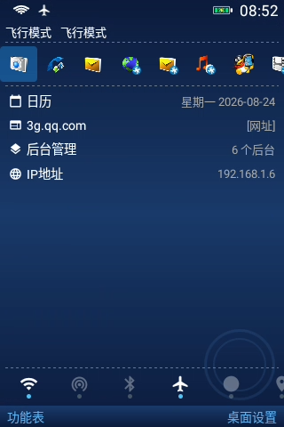
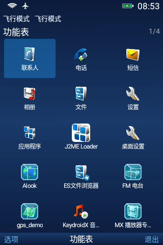
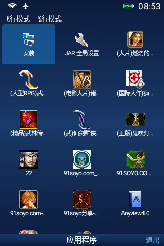

# KeydroidX（原键桌面）

> 专为现代智能按键机（Feature Phone / Keyphone）打造的全功能复古桌面启动器（Launcher）
>
> 深度融合物理按键导航交互与 J2ME 生态能力，为实体按键设备提供极致流畅、高度定制的极简系统体验。

[](#)
[](#)
[](#)

---

## 纯粹专注，指尖掌控


这不是一个普通启动器。它是专为按键机爱好者、极简主义者以及备用机用户打造的现代实体键生态桌面：
- **物理按键优先**：方向键导航 + 左右软键 + 确认键，全界面元素 100% 可通过物理按键精准高亮与操作；
- **原生与 J2ME 深度融合**：安卓应用与 JAR 经典游戏/工具在桌面上统一管理，JAR 收纳于「百宝箱」；
- **生态按键服务中枢**：内置 KeydroidX KeyProvider，跨应用向第三方独立应用（音乐、浏览器等）统一共享全局按键配置。







---

## 主要特性
- **仿诺基亚风格**：以诺基亚ui为参考而进行设计
- **经典复古 UI**：顶部实时状态栏（双卡真实信号 / WiFi / 电池电量 / 运营商 / 时间），底部经典三栏软键。
- **功能表矩阵**：第 1 页为系统核心功能（信息 / 联系人 / 通话记录 / 日历 / 相册 / 相机 / 设置 / 桌面设置），第 2 页起为已安装的安卓应用；JAR 应用统一收口于「百宝箱」。
- **桌面快捷栏**：支持自由编辑常用应用与功能快捷方式，图标即应用真实图标。
- **生态按键共享**：向整个 KeydroidX 生态独立应用广播按键映射，用户一次配键，全套独立应用生效。
- **通知中枢**：读取系统通知并在桌面下半部滚动展示，支持按键查看与一键清除。
- **按键音效**：按下实体物理按键时播放清脆的机械提示音。
- **系统级集成**：完美支持设为系统默认 Home 桌面。


---

## 构建与安装

环境要求：

- Android SDK + **JDK 17**（Temurin / OpenJDK 17）
- NDK `22.1.7171670`
- 本地签名：`app/test.jks` + `keystore.properties`（已 git-ignore）

构建 Release APK（推荐 `open` 渠道）：

```bash
.\gradlew.bat assembleOpenRelease -x lint
```

输出路径：`app/build/outputs/apk/open/release/KeydroidX-*-open-release.apk`

---

## mini_shizuku 权限服务

部分高级桌面功能需要系统级（shell/adb）权限。应用内置了 **mini_shizuku**：以 `app_process` 服务端运行于设备上，通过本地 TCP 隧道以 shell 权限执行系统命令。

### 激活步骤（只需一次，电脑 USB 调试）

1. 手机开启「开发者选项 → USB 调试」，连接电脑。
2. 手机进入「桌面设置 → 高级设置 → mini_shizuku → adb 激活」，页面会显示激活命令。
3. 在电脑命令行执行该命令：

   ```bash
   adb shell sh /sdcard/Android/data/io.github.cctyl.nokia.debug/files/mini_shizuku.sh
   ```

4. 手机返回 mini_shizuku 页面，按左软键「刷新」，显示「在线」即激活成功。

---


## 致谢与开源许可

本项目基于开源社区优秀项目与资源开发，特此致谢：

- **J2ME 模拟核心**：基于 [J2ME-Loader](https://github.com/nikita36078/J2ME-Loader) 开发，感谢原作者 [nikita36078](https://github.com/nikita36078)。
- **复古像素字体**：
  - **方舟像素字体 (Ark Pixel Font)**：由 [TakWolf](https://github.com/TakWolf/ark-pixel-font) 开发设计的开源泛中日韩像素字体（SIL Open Font License 1.1）。
  - **缝合怪像素字体 (Fusion Pixel Font)**：由 [TakWolf](https://github.com/TakWolf/fusion-pixel-font) 整合开发的超全字符集像素字体（SIL Open Font License 1.1）。
- **矢量图标体系**：
  - **Google Material Icons**：由 Google 团队提供的开源矢量图标字库（Apache License 2.0）。
  - **S60 图标库 (s60-icon-pack)**：由 [x1unix](https://github.com/x1unix) 整理的经典系统图标库（[s60-icon-pack](https://github.com/x1unix/s60-icon-pack)）。
