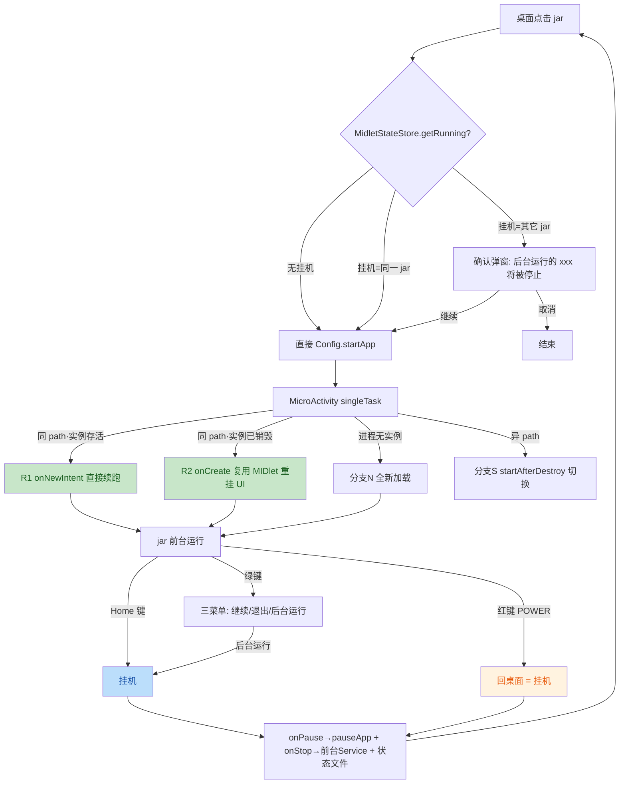

# JAR 应用挂机（后台运行）方案设计

> 版本：v1.1　　日期：2026-08-15
> 模块：`:midlet` 进程 / 原键桌面 / native 拦截器
> 关联 bug 清单条目：343（挂机 jar 显示到后台管理组件、可清除）、361（jar 内按挂机键不应锁屏应回桌面）、362（后期做成挂后台）、365（相机/拨号界面按挂机键误锁屏）
>
> **v1.1 变更**：真机首轮测试暴露 4 个问题，根因排查与修复见文末《附录 A：首轮实测问题修复记录》。核心教训：**debug 变体曾用 `tools:remove="android:process"` 移除 MicroActivity 的 `:midlet` 进程隔离**（上游遗留），使本方案的全部进程隔离前提失效；现已恢复隔离。

---

## 1. 目标与范围

jar 应用（MIDlet）支持「挂机」：进入 jar 后按**挂机菜单键（绿键）**弹出三菜单（继续 / 退出 / 后台运行），
选择「后台运行」回到桌面但 jar 进程存活、状态保留；再次进入**同一个** jar 时**续跑不重启**；
进入**另一个** jar 前弹确认「后台运行的 xxx 将被停止，是否继续」；挂机中的 jar 显示在
「后台管理」组件中，可保护、可清除；jar 内按**红键（物理挂机键）**回桌面（不锁屏），jar 转入挂机。

### 明确范围

- **同一时刻只允许一个 jar 运行/挂机**（`:midlet` 单实例架构决定，见 §3.1）。
- 挂机 = MIDlet 收到 `pauseApp()`（J2ME 标准挂起语义），MIDlet 自身线程继续跑。
- 兼容 Android 4.4（API 19）至最新版本。
- 红键行为修正（bug 361）**本次一起做**，涉及 native 拦截器一处小改 + App 侧一次快速上报。

---

## 2. 术语与关联文档

| 术语 | 含义 | 备注 |
|---|---|---|
| **挂机菜单键（绿键）** | 用户可绑定的物理键，默认 `KEYCODE_CALL`（拨号键），**仅在 jar 内生效**，弹出三菜单 | 新增绑定项，显示名「挂机」 |
| **红键（物理挂机键）** | 物理电源键（`KEY_POWER`），由 native 拦截器接管，全局面行为 | 见《挂机键行为定义.md》，**与本文的「挂机」是两个概念**；与 `NokiaKeyBinding` 的「锁屏」绑定（默认 ENDCALL）亦无关 |
| 挂机 | jar 转入后台、进程存活、MIDlet 收到 `pauseApp()`，可随时续跑 | — |
| 续跑 | 再次进入同一 jar，不重新 `new MIDlet`，恢复到挂机时界面 | — |

关联文档：
- 《挂机键行为定义.md》——红键行为唯一权威定义（行为矩阵/状态机）。本文 §6.9 的修正使 jar 场景落到其 A 态（回桌面），矩阵本身不变。
- 《电源键拦截方案设计.md》——native 拦截技术链路。
- 《NOKIA_DEVELOPMENT_RULES.md》——按键、弹窗、尺寸规范。

> 注意区分：桌面设置 → mini_shizuku → 「挂机键拦截」指的是红键（POWER）拦截开关；
> 按键绑定里的「挂机」指的是本方案新增的绿键菜单动作。

---

## 3. 现状机制（改哪里、为什么）

### 3.1 进程与生命周期模型

| 组件 | 进程 | 说明 |
|---|---|---|
| `NokiaDesktopActivity` | 主进程 | 桌面宿主（HOME，singleTask） |
| `MicroActivity` | `:midlet` | MIDlet 的 Android 前台；manifest 中当前为 `standard` 启动模式 |
| `MidletThread` | `:midlet` | **静态单例**（`static MidletThread instance`）驱动 MIDlet 状态机 INIT/START/PAUSE/DESTROY |
| `Display`/`ContextHolder`/`VirtualKeyboard` | `:midlet` | 全 static —— 单实例架构的根因 |

关键现状行为（均已核实源码）：

1. `MicroActivity.onPause()` → `MidletThread.pauseApp()` → `midlet.pauseApp()`；
   `onResume()` → `resumeApp()` → `midlet.startApp()`。
   **即：按 Home 键回桌面时 MIDlet 已处于挂起、进程存活 —— 「物理挂机」现在就成立。**
2. `MicroActivity.onDestroy()` 只置 `binding = null`，**不销毁 MIDlet、不杀进程**。
3. 再次点击 jar → `Config.startApp()` → `startActivity` 新建 `MicroActivity` 实例 →
   `onCreate` → `loadMIDlet()` → `MidletThread.create()` → **重新 new 一个 MIDlet**，
   旧实例被静态字段覆盖抛弃。**这是「不能挂机」的唯一核心障碍。**
4. 退出路径 `MidletThread.notifyDestroyed()` 最后 `Process.killProcess(myPid())` 整进程死亡；
   切换 jar 的现成机制 `MidletThread.startAfterDestroy[]`：销毁前先 `Config.startApp(新jar)`，
   进程死后 AMS 重新拉起 `:midlet` 进程加载新 jar（`MIDlet.platformRequest` 在用，可靠）。
5. `NokiaBgManagerHelper.isSelfProcess()` 排除 `pkg:*` 自身进程 ——
   **当前后台管理看不到挂机 jar**；且 `am force-stop` / `killBackgroundProcesses` 作用于
   **整个包**，会把桌面一起杀 —— 清除挂机 jar **必须精确杀 `:midlet` 进程**。

### 3.2 UI 挂载机制（复用进程的关键依据）

`MicroActivity` 内部类 `SetCurrentEvent.process()` 执行
`binding.displayableContainer.removeAllViews()` + `addView(next.getDisplayableView())`。
即 **Displayable 持有自己的 Android View 对象，View 可从旧（已销毁的）Activity 容器
重新挂到新 Activity 容器** —— Activity 重建后复用进程内 MIDlet 并重挂 UI 在机制上可行。

### 3.3 红键在 jar 内误锁屏的根因（bug 361）

《挂机键行为定义.md》行为矩阵 A 态已定义：亮屏 + 非诺基亚应用 → 按红键 → **回原键桌面**。
但 jar 界面（`MicroActivity`）与桌面**同包名、不同 activity**，native 侧：

- `interceptor.c` 的 `extract_front_package()` 只提取 `/` 之前的**包名**；
- `is_nokia_package()` 按包名匹配 → jar 前台时 `front_is_nokia=1`；
- 决策处 `else if (front_is_nokia && page_is_main)` → 走 C 态**锁屏**。
  而 `page_is_main` 是 `NokiaDesktopActivity` 上次上报的**陈旧值**（通常 1=待机屏）。

结果：jar 内按红键 → 误判「桌面主界面」→ 锁屏。修正方案见 §6.9。

---

## 4. 总体设计

### 4.1 启动模式变更（防实例叠加，先行条件）

`AndroidManifest.xml` 中 `MicroActivity` 增加 `android:launchMode="singleTask"`：

- jar 挂机（Activity 仅 stopped、未销毁，如按系统 Home 键路径）后再点同一 jar →
  **复用既有实例**（`onNewIntent` + `onResume`），零重挂风险，续跑最快（**恢复路径 R1**）；
- jar 挂机（Activity 已被销毁、进程存活，如红键/CLEAR_TOP 路径）后再点同一 jar →
  新建 Activity 实例，进程内复用 MIDlet 并重挂 UI（**恢复路径 R2**）；
- 杜绝 `standard` 模式下「每次 startActivity 叠一个新实例」的堆栈累积缺陷
  （原草案缺陷：Home 挂机后再进会叠加实例，旧实例空壳残留）。

`MicroActivity` 为 `exported="false"`、仅内部启动，singleTask 无副作用。

### 4.2 两条恢复路径 + 三种 onCreate/onNewIntent 分支

```
进入 MicroActivity
 ├─ 分支 N（全新）：MidletThread.instance == null 或 state == DESTROYED（销毁进行中另见 §7-3）
 │    现有逻辑不变：microLoader.init() → loadMIDlet() → MidletThread.create()
 │    追加：登记 runningAppPath / 保存 orientation+menuKey / 写状态文件
 ├─ 分支 R（复用，同 jar）：
 │    R1（onNewIntent，Activity 存活）：校验 appPath 相同 → 仅刷新键码表缓存，
 │        生命周期自动 onResume → resumeApp()，无其他动作
 │    R2（onCreate，Activity 重建、进程存活）：跳过 microLoader.init()（防清缓存）
 │        与 loadMIDlet()；恢复 VK/方向/菜单键；setCurrent(挂机时的 displayable) 重挂 UI
 └─ 分支 S（切换，异 jar）：
      startAfterDestroy = {新name, 新path, args} → MidletThread.destroyApp()
      （复用现有机制：销毁旧 → 进程死 → AMS 重启进程 → 分支 N 加载新 jar）
```

### 4.3 状态与通信设计（全部跨版本兼容，无新权限）

| 需求 | 方案 | 不用的方案及原因 |
|---|---|---|
| 主进程感知「哪个 jar 在挂机」 | **状态文件** `files/midlet_state.properties`（`:midlet` 进程原子写：tmp+rename；主进程直接读） | SP 跨进程有缓存失效问题；ContentProvider 过重 |
| 判断挂机进程是否存活 | `ActivityManager.getRunningAppProcesses()` 匹配 `包名:midlet`（**对自己 uid 的进程全版本可见**，API 21 收紧不影响）+ 状态文件 pid 校验 | 不依赖 mini_shizuku（4.4 无、5.0+ 未激活也可用） |
| 清除挂机 jar（精确杀 `:midlet`） | 显式广播 → `:midlet` 进程内 `NokiaMidletControlReceiver` → `MidletThread.destroyApp()`（优雅走 MIDlet 生命周期：END 键 → destroyApp(true) → notifyDestroyed → 清状态 → killProcess） | `force-stop`/`killBackgroundProcesses` 会连桌面一起杀 |
| `:midlet` 进程获知绿键绑定 | **Intent extra 传 int[] 键码表**（桌面启动时序列化 `NokiaKeyBinding`）；extra 缺省时回退读 SP（新进程首次读必是最新文件值，无缓存问题） | SP 跨进程读在进程存活期间有缓存陈旧问题 |
| jar 前台状态快速通知 native 拦截器 | `MicroActivity.onResume/onPause` 调 `Shizuku.setPageState(false/恢复由桌面重新上报)`（复用既有 PAGE_STATE TCP 通道，~5ms） | 见 §6.9（闭合 native 2s 轮询窗口） |
| 挂机进程保活 | 前台 Service（`startForeground` 常驻通知，API 26+ 渠道守卫），仅挂机期间存在 | — |

### 4.4 流程总览



---

## 5. 挂机菜单键绑定（`NokiaKeyBinding` 扩展）

改动点（单文件；设置页/向导 UI 均按 `ACTION_COUNT` 动态循环，**自动适配无需改**，
已核实 `NokiaKeyBindFragment` / `NokiaKeyBindWizardFragment` 无硬编码 8 处，仅注释需更新）：

| 项 | 改动 |
|---|---|
| 动作常量 | 新增 `ACTION_HANGUP = 8`；`ACTION_COUNT` 8 → **9** |
| `PREF_KEYS` | 追加 `"hangup"`（老用户 SP 无此键 → `load()` 自动落默认值，**无迁移**） |
| `DEFAULT_KEYCODES` | 追加 `KeyEvent.KEYCODE_CALL`（绿色拨号键） |
| `getActionName(ACTION_HANGUP)` | 返回 `"挂机"`（向导提示自动为「请按下『挂机』键」） |
| 冲突处理 | 沿用 `setKeyCode` 现有的一对一冲突自动解除 |
| 老用户（向导已完成） | 不重弹向导，挂机键默认 `KEYCODE_CALL`，可在「按键绑定」设置中修改 |
| 生效范围 | 仅 `MicroActivity`（jar 内）拦截；桌面/其他界面不消费该键 |

---

## 6. 详细设计

### 6.1 跨进程状态（新文件 `util/MidletStateStore.java`）

```java
// 文件：context.getFilesDir() + "/midlet_state.properties"
// 字段：appPath / appName / pid
public static void write(Context, String appPath, String appName)  // :midlet 进程写，tmp+rename 原子
public static void clear(Context)                                   // :midlet 进程清
public static RunningInfo getRunning(Context)                       // 主进程唯一读取入口：
    // 1) 读文件 → 2) getRunningAppProcesses 匹配 包名+":midlet" 且 pid 一致
    // 3) 进程不存在 → 删除残留文件、返回 null（覆盖 LMK 杀进程/崩溃残留）
public static String taskKey(String appPath)                        // 返回 "midlet:" + appPath
                                                                   // （后台管理保护名单 key，与包名空间天然隔离）
```

写入时机（MicroActivity 内，两处）：`loadMIDlet()` 单 MIDlet 直接 `create` 后、
多 MIDlet 选择对话框确认回调 `create` 后。恢复分支（R1/R2）不重写（值不变）。
清除时机：`MidletThread.notifyDestroyed()` 内 `killProcess` 之前（commit 同步写）。

### 6.2 `MidletThread` 静态扩展（挂机状态载体）

| 新增静态字段 | 写入点 | 用途 |
|---|---|---|
| `static String runningAppPath` | `create()` 成功后（MicroActivity 写）；`notifyDestroyed()` 清 | 分支判定；状态文件内容来源 |
| `static Displayable currentDisplayable` | `MicroActivity.setCurrent()` 每次同步 | 分支 R2 重挂 UI |
| `static int savedOrientation / savedMenuKey` | 首次 `setOrientation()`/赋值 `menuKey` 时保存 | 分支 R2 恢复配置（跳过 `microLoader.init()` 后无来源） |
| `static boolean hasInstance()` | — | 分支判定（state==DESTROYED 视为无实例，见 §7-3） |

### 6.3 `MicroActivity` 改造

**(1) onCreate 三分支**（插入在 `microLoader = new MicroLoader(...)` 之后）：

- **分支 R2（复用，核心新增）**：
  1. 跳过 `microLoader.init()`（其内部 `clearDirectory(cacheDir)` 会破坏挂机 MIDlet 的缓存）、
     跳过 `MidletSystem.setProperty`、跳过 `loadMIDlet()`/`MidletThread.create()`
  2. `VirtualKeyboard vk = ContextHolder.getVk()`（进程级存活）→ `vk.setView(binding.overlayView)`、
     `binding.overlayView.addLayer(vk)`（与现逻辑相同）；vk 为 null 则跳过
  3. `setOrientation(MidletThread.savedOrientation)`、`menuKey = MidletThread.savedMenuKey`
  4. `setCurrent(MidletThread.currentDisplayable)` → 触发 `SetCurrentEvent` →
     新容器 `removeAllViews()` + `addView(旧 Displayable 的 View)` 完成重挂
  5. 不调 `resumeApp()`（onResume 会调；且 `handleMessage` 的 START 在 state!=PAUSED 时
     自动忽略，幂等安全）
- **分支 S（切换）**：`MidletThread.startAfterDestroy = {appName, appPath, arguments}` →
  `MidletThread.destroyApp()` → `finish()` → return（复用 §3.1-4 机制）
- **分支 N（全新）**：现有逻辑原样，仅在 `MidletThread.create()` 成功点追加：
  `MidletThread.runningAppPath = appPath`、`savedOrientation/savedMenuKey` 保存、
  `MidletStateStore.write(this, appPath, appName)`

**(2) onNewIntent（新增，恢复路径 R1）**：

```java
onNewIntent(intent):
    setIntent(intent)
    解析并刷新键码表缓存（extra 有则覆盖）
    if (instance == null || state == DESTROYED) return   // 交给已有销毁流程
    if (runningAppPath != null && !runningAppPath.equals(newAppPath)):
        分支 S 逻辑（切换销毁）
    // 同一 jar：无动作。生命周期自动 onResume → resumeApp() → midlet.startApp() 续跑
```

**(3) 键码表读取**：onCreate/onNewIntent 解析 intent extra `int[] keycodes`
（9 元素，`NokiaKeyBinding` 序列化）；缺省（`:midlet` 进程内 `startAfterDestroy` 重启路径）时回退
`context.getSharedPreferences("nokia_key_bindings", MODE_PRIVATE)` 逐键读取
（新进程首次读 = 最新文件值，无陈旧缓存）。

**(4) 绿键（挂机菜单键）拦截**（`dispatchKeyEvent`，super 调用之前）：

```
keyCode == keycodes[ACTION_HANGUP] 且 isBound（!= KEYCODE_UNKNOWN）：
  ACTION_DOWN / ACTION_REPEAT → return true（消费，不转发 MIDlet，防长按重复）
  ACTION_UP（无 FLAG_CANCELED）→ 弹三菜单，return true
三菜单已打开期间 → 挂机键交给弹窗处理（=执行「继续」）
```

`dispatchKeyEvent` 位于 `onKeyUp` 之前，即使绿键被绑成 BACK/MENU 也天然优先，无冲突。

**(5) 三菜单 `MidletMenuDialog`**（`:midlet` 进程内自实现，不依赖 NokiaDesktopActivity）：

- 形态：AlertDialog + 三行列表（0=继续 / 1=退出 / 2=后台运行）+ 自绘选中高亮
  （样式对齐 `NokiaOptionsDialog` 的行规格：11sp 白字 + 选中深色底），标题显示 appName。
- **按键自处理**（Dialog 独立 Window，必须自己接键；键值全部来自 §6.3-(3) 键码表）：

| 按键 | 行为 |
|---|---|
| 上 / 下 | 移动高亮 |
| 确认 / 左软键 | 执行高亮项 |
| 绿键 / 右软键 / BACK | 关闭弹窗（等效「继续」） |
| 触摸 | 点行直接执行 |

- 动作实现：
  - **继续**：`dismiss()`
  - **退出**：`dismiss()` + `hideSoftInput()` + `MidletThread.destroyApp()`（与现有
    `showExitConfirmation` 确认按钮完全一致，含 1s 强杀兜底）
  - **后台运行**：`dismiss()` + 显式回桌面：
    `Intent(ACTION_MAIN).addCategory(CATEGORY_HOME)`
    `.setClassName(this, NokiaDesktopActivity)` + `FLAG_ACTIVITY_NEW_TASK`（**不加 CLEAR_TOP**，
    保留本 Activity 实例 stopped → 下次走 R1 快速续跑）→ 桌面 `onNewIntent → goHome()` 回待机屏
    → 本 Activity `onPause → pauseApp()`（挂机）→ `onStop` 触发保活 Service（§6.4）。
    显式组件保证即使本应用未被设为默认桌面，也回到原键桌面。
    注：native 红键路径（§6.9）带 CLEAR_TOP 会销毁实例 → 下次走 R2，两条路径均成立。

**(6) onStop / onResume 与 Service 联动**：

```java
onStop():  若 MidletThread.hasInstance() 且 runningAppPath != null
           → startService(NokiaMidletKeepAliveService)   // 覆盖绿键/红键/Home 键全部挂机路径
onResume(): stopService(NokiaMidletKeepAliveService)      // 回前台撤通知
```

`onDestroy` 不改（现状不销毁 MIDlet 正是挂机所需）。exit 路径 `destroyApp → killProcess`
后 Service 与通知随进程消亡，无残留。

**(7) PAGE_STATE 快速上报（配合 §6.9）**：
`onResume()` 追加 `Shizuku.setPageState(false)`（jar 前台 ≈「桌面非主界面」语义，
使红键决策落到 go_home 分支；mini_shizuku 未运行时该调用静默无副作用）。
jar 离开后无需本进程恢复值——桌面 `NokiaDesktopActivity` 在 onResume/goHome/
Fragment 切换时会重新上报真实页面状态（既有机制，见《挂机键行为定义.md》§9.6）。

### 6.4 保活前台 Service（新文件 `nokia/NokiaMidletKeepAliveService.java`）

- manifest：`android:process=":midlet" android:exported="false"`，无 intent-filter。
- `onStartCommand()`：
  1. **僵尸防御**：`!MidletThread.hasInstance()` → `stopSelf()` 返回 START_NOT_STICKY
     （系统 START_STICKY 重启后进程内已无 MIDlet，避免出现无意义常驻通知）
  2. `startForeground(1, notification)`；`appName` 取 `MidletStateStore` 读到的名称。
- 通知：标题 = appName，文本 = 「正在后台运行」；
  `contentIntent` = PendingIntent 打开 `MicroActivity`（intent 携带状态文件中的 appPath/appName +
  键码表 extra + `FLAG_ACTIVITY_NEW_TASK`）→ 走恢复分支（R1/R2）回到 jar。
  API 26+ 建 NotificationChannel（守卫包裹）；小图标用现有 `ic_launcher` 资源，不新增。
- `onDestroy()`：`stopForeground(true)`。

### 6.5 清除通道（新文件 `nokia/NokiaMidletControlReceiver.java`）

- manifest：`android:process=":midlet" android:exported="false"`，
  action = `ru.playsoftware.j2meloader.ACTION_DESTROY_MIDLET`（显式 Intent 调用）。
- `onReceive()`：`MidletThread.destroyApp()`；`instance == null` 时直接
  `Process.killProcess(Process.myPid())`（进程内已无 MIDlet，直接自杀清场）。
- 链路：`destroyApp()` → 给 Canvas 发 KEY_END（MIDlet 可走正常收尾）→ `destroyApp(true)`
  → `notifyDestroyed()`（**此处追加 `MidletStateStore.clear()`**，在 `killProcess` 前）→
  Activity finish → 进程死 → 通知/Service 随之消亡。

### 6.6 桌面启动入口（新文件 `nokia/NokiaJarLauncher.java`）

```java
public static void launch(FragmentActivity act, String name, String path) {
    MidletStateStore.RunningInfo r = MidletStateStore.getRunning(act.getApplicationContext());
    if (r == null || r.appPath.equals(path)) {          // 无挂机 或 同一 jar：直接启动
        Config.startApp(act, name, path, false);
        return;
    }
    // 有其它 jar 挂机 → 确认弹窗（复用 NokiaOptionsDialog，自带按键接入，符合弹窗规范）
    // 标题「提示」 文案「后台运行的『r.appName』将被停止，是否继续？」
    // 选项：继续 → Config.startApp(act, name, path, false)
    //       取消 → 关闭，无事发生
}
```

**调用点替换**（`Config.startApp` 本身保持无 UI 不动）：

| 文件 | 位置 | 改动 |
|---|---|---|
| `NokiaBoxFragment` | onSelect 直接启动（2 处 `startApp(..., false)`） | 换 `NokiaJarLauncher.launch` |
| `NokiaBoxFragment` | 「设置」入口（`startApp(..., true)`） | **不换**（打开 ConfigActivity，不触发启动） |
| `NokiaDesktopFragment` | `launchShortcutApp()` TYPE_J2ME 分支 | 换 `NokiaJarLauncher.launch` |

**`Config.startApp` 唯一增补**：构造 MicroActivity intent 时附加键码表 extra
（`new NokiaKeyBinding(context)` 读当前绑定序列化为 `int[]`）。

### 6.7 后台管理联动

**(1) 显示挂机条目**（`NokiaBgManagerHelper.enumerateBackgroundTasks` 末尾追加）：

```java
MidletStateStore.RunningInfo r = MidletStateStore.getRunning(ctx);
if (r != null) {
    out.add(new BgTask(MidletStateStore.taskKey(r.appPath), r.appName,
            loadJarIcon(r.appPath), protectedSet.contains(taskKey)));
}
// 不依赖 mini_shizuku / 版本路径：4.4 与 5.0+ 行为一致（自己进程全版本可枚举）
// 现有 ps/getRunningAppProcesses 路径因 isSelfProcess 排除自身，与该条目无重复
```

- `loadJarIcon`：新增 `AppUtils.findAppByPath(String path)`（遍历 `Config.getAppDir()` 按
  `getPathExt()` 匹配），图标复用百宝箱的 AppItem 图标加载；失败返回 null
  （`createTaskRow` 已有 `ic_launcher` 兜底）。
- 排序沿用现有按 name 排序，挂机条目自然混排。

**(2) 清除逻辑**（`clearBackgroundTasks` 循环内追加分支）：

```java
if (t.pkg.startsWith("midlet:")) {          // 挂机 jar 条目
    if (t.prot) continue;                    // 受保护 → 跳过
    ctx.sendBroadcast(显式 Intent(ACTION_DESTROY_MIDLET
            .setClass(ctx, NokiaMidletControlReceiver.class)));  // 见 §6.5
    cleared++;
    continue;                                // 绝不走 am force-stop / killBackgroundProcesses
}
```

**(3) 保护与交互**（`NokiaBackgroundManagerFragment`）：
- 选中 + 确认 = 切换保护状态：key 为 `"midlet:<appPath>"`，`toggleProtect` 现有按 key 存取
  逻辑**零改动**自然兼容；「全部保护 / 全部解除」同样按 key 生效。
- 「清除全部」/ 数字 0 一键清理：乐观移除已含（`tasks.removeIf(t -> !t.prot)` 覆盖挂机条目，
  零改动）；进程实际死亡有 ≤1s 延迟（destroyApp 兜底强杀），下次进入页面重新枚举自然校正。
- 行右侧标记：受保护显示盾牌、未保护显示「可清」—— 挂机条目与普通条目一致，零改动。

### 6.8 与红键状态机的关系（整合视图）

jar 的三种「离开方式」全部殊途同归为挂机：

| 离开方式 | 链路 | MicroActivity 结局 | 下次进入 |
|---|---|---|---|
| 三菜单「后台运行」（绿键） | 显式 HOME（NEW_TASK，无 CLEAR_TOP） | stopped（存活） | **R1** onNewIntent |
| 系统 Home 键 | 系统 bring launcher forward | stopped（存活） | **R1** onNewIntent |
| 红键（POWER，native） | `inject_go_home`：`am start -f 0x14000000`（含 CLEAR_TOP） | **finished** | **R2** onCreate 重挂 |

### 6.9 红键 jar 内行为修正（bug 361）

目标：《挂机键行为定义.md》A 态语义落到 jar 场景——**jar 内按红键 = 回原键桌面，jar 转挂机**。
双保险实现（两层互补）：

**(1) native 侧（主修正，语义正确）** —— `interceptor.c`：

- `update_front_window()` 增强：在 `Window{...}` 内提取 `/` 之后的 **activity 全名**
  （现有 `extract_front_package` 只取包名，格式
  `mCurrentFocus=Window{hash u0 pkg/javax.microedition.shell.MicroActivity}`，activity 名天然在输出中）；
- 判定：activity 名以 `MicroActivity` 结尾 → **`front_is_nokia = 0`**（jar 界面不算原键桌面）；
- 效果：短按红键决策落到 else 分支 `inject_go_home`（A/B 态）→ 回桌面待机屏 →
  `NokiaDesktopActivity.onNewIntent → goHome()` → CLEAR_TOP 销毁 MicroActivity →
  `onPause → pauseApp()` 挂机、`onStop` 起保活通知、后台管理出现条目（全链路与本方案自动衔接）。
- debug/release 两个 flavor 的 MicroActivity 类路径相同（`javax.microedition.shell.MicroActivity`），
  后缀匹配即可；不依赖包名，不受 flavor 切换影响。

**(2) App 侧快速上报（闭合 2s 轮询窗口）** —— 见 §6.3-(7)：

- native 前台窗口靠 2000ms 轮询（`dumpsys`），存在「刚进 jar ≤2s 内按红键仍误锁屏」窗口；
- `MicroActivity.onResume` 主动 `Shizuku.setPageState(false)`（TCP ~5ms），
  使决策立即落入 go_home 分支；jar 离开后由桌面上报真实页面状态，无残留污染
  （若 mini_shizuku/拦截器未启用，此调用静默无效，行为同现状）。

**(3) 文档同步**：实现时在《挂机键行为定义.md》§2「界面分层」表补充一行说明：
jar 界面（`MicroActivity`，同包名异进程异 Activity）归入「非诺基亚应用」类，行为矩阵不变。

---

## 7. 场景走查（逐一定义预期行为）

| # | 场景 | 流程 | 结果 |
|---|---|---|---|
| S1 | 首次启动 jar A | 桌面 → `NokiaJarLauncher.launch`（无挂机）→ MicroActivity 分支 N | 全新加载，状态文件写入 |
| S2 | jar A 运行中，按绿键 → 后台运行 | 三菜单 → 显式 HOME → 桌面 goHome → MicroActivity stopped → pauseApp → onStop 起 Service | 挂机：进程活、MIDlet 挂起、通知栏常驻、后台管理可见条目；下次走 R1 |
| S3 | jar A 运行中，直接按 Home 键 | 不经三菜单，其余同 S2 | 挂机（静默，下次走 R1） |
| S4 | jar A 运行中，按红键（POWER） | §6.9 → inject_go_home（CLEAR_TOP）→ 桌面 goHome → MicroActivity finished → 挂机链路 | **回桌面不锁屏**（bug 361 修正）；下次走 R2 |
| S5 | 刚进入 jar ≤2s 内按红键 | §6.9-(2) 快速上报已生效 | 同 S4，无误锁屏 |
| S6 | 挂机 A 中，百宝箱/快捷栏再点 A | `getRunning` appPath 相同 → 不弹确认 → R1（实例存活）或 R2（已销毁） | **续跑**：原界面恢复、startApp 恢复、Service 撤除 |
| S7 | 挂机 A 中，点 jar B | 确认弹窗「后台运行的『A』将被停止，是否继续？」→ 继续 → 分支 S | A 走 destroyApp 优雅退出 → 进程死 → AMS 重启 → B 全新加载 |
| S8 | S7 中选「取消」 | 关闭弹窗 | 无任何变化，A 继续挂机 |
| S9 | 挂机 A 未保护，后台管理「清除全部」/ 按 0 | 显式广播 → receiver → destroyApp → END 键 → destroyApp(true) → 清状态 → killProcess | A 停止、条目消失、通知消失 |
| S10 | 挂机 A 已保护 | clear 循环 `prot` 跳过 | 清除其它后台时 A 不受影响 |
| S11 | 三菜单 → 退出 | destroyApp（与现有退出路径一致） | 进程死、状态文件清 |
| S12 | 三菜单打开时按红键 | 弹窗随 Activity 销毁，红键路径照常 | 直接回桌面挂机 |
| S13 | 挂机中进程被 LMK 杀 / 崩溃 | 文件残留；主进程 `getRunning` 校验 `:midlet` 进程已死 → 删文件返回 null；START_STICKY 重启的 Service 自检无实例 → stopSelf | 桌面一切入口视为无挂机（下次点 jar 走分支 N）；无僵尸通知 |
| S14 | jar A 内部 `platformRequest` 拉起 jar B | 现有 `startAfterDestroy` 机制原样 | 不受本方案影响 |
| S15 | 挂机中点通知栏常驻通知 | PendingIntent → MicroActivity（appPath+键码）→ R1/R2 | 直接回到 jar 续跑 |
| S16 | 绿键未绑定（用户解绑） | extra 中该键 = KEYCODE_UNKNOWN → 拦截条件不成立 | 按键透传给 MIDlet，三菜单不出现 |
| S17 | 绿键与其它动作绑同一物理键 | `setKeyCode` 现有冲突自动解除 | 一对一，无歧义 |
| S18 | Android 4.4 全流程 | 挂机条目/枚举/清除均不依赖 shizuku（广播+自身进程枚举）；红键走 native 拦截器（4.4 同样可用） | 与 5.0+ 行为一致 |
| S19 | 挂机 A 中，MIDlet 自身弹窗（Alert）在前 | R2 的 `setCurrent` 用挂机前最后一刻的 currentDisplayable（含 Alert） | 恢复到挂机时所见界面 |
| S20 | Home 挂机 → 再进 → 再 Home → 再进，反复 10 次 | singleTask 复用同一实例（R1） | 无实例叠加、无空壳残影、无泄漏 |
| S21 | 挂机后在桌面待机屏按红键 | 桌面 onResume 已重新上报真实页面状态 | 正常锁屏（状态机不受 jar 上报污染） |

---

## 8. 边界与防御

1. **状态文件与进程存活的原子性**：一切读取都走 `MidletStateStore.getRunning()`（文件 +
   进程名 + pid 三重校验），主进程任何地方不直接信文件。
2. **`notifyDestroyed` 的时序**：`MidletStateStore.clear()` 必须插在 `Config.startApp(切换)`
   之后、`killProcess` 之前 —— 切换场景 S7 中 B 的新状态会随后覆写，中间窗口桌面读到
   「无挂机」无害（B 即将全屏启动）。
3. **分支 R 的 DESTROYED 竞态**：`instance.state == DESTROYED`（销毁进行中、进程将死）时
   不复用，降级走分支 N（会被随后的 killProcess 打断，用户重进即可）。窗口 <1s，极小概率，
   行为降级为「重启应用」而非错误。
4. **复用路径 R2 跳过 `microLoader.init()`**：避免 `clearDirectory(cacheDir)` 破坏挂机 MIDlet 的
   文件缓存、避免 `Display.initDisplay()` 重复初始化。orientation/menuKey 由 §6.2 静态缓存提供。
5. **多 MIDlet jar**：挂机恢复（R1/R2）不重弹选择框（已选定）；首次加载的选择框逻辑不变。
6. **arguments**：恢复分支忽略本次 intent 的 arguments 差异（同一 jar 视为同一配置）。
7. **后台管理清除后立即再点该 jar**：进程死亡为异步（≤1s）。若用户极速操作，`getRunning`
   仍见进程存活 → 直接 startActivity → 进程恰死 → AMS 重启进程 → 分支 N。结果仍正确。
8. **通知 PendingIntent 的 intent**：必须携带与状态文件一致的 appPath/appName 与键码表
   extra（Service 从状态文件 + `:midlet` 进程内 NokiaKeyBinding 快照获取）。
9. **Android 12+ 前台 Service 启动限制**（targetSdk 31+）：Service 由 `onStop`（应用仍在前台
   的生命周期回调）内启动，属于允许场景；若实测 targetSdk 行为有变，退路为
   「挂机动作（三菜单后台运行 / HOME 键 UP）时显式 startForegroundService」。
10. **`setPageState(false)` 的覆盖语义**：jar 前台期间 page_is_main 恒为 0，仅影响红键决策
    （front_is_nokia=0 时该值本就不参与分支）；jar 离开后桌面重新上报，不存在脏值残留。

---

## 9. 改动文件清单

| 文件 | 类型 | 内容 |
|---|---|---|
| `nokia/NokiaKeyBinding.java` | 改 | ACTION_HANGUP / ACTION_COUNT=9 / 默认 CALL / 名称「挂机」 |
| `nokia/NokiaKeyBindFragment.java` | 改 | 仅更新类注释「8 个动作」→「9 个动作」（UI 循环自动适配） |
| `util/MidletStateStore.java` | **新** | 状态文件读写 + 进程存活校验 + taskKey |
| `shell/MidletThread.java` | 改 | 静态：runningAppPath / currentDisplayable / savedOrientation / savedMenuKey / hasInstance()；notifyDestroyed 追加清状态文件 |
| `shell/MicroActivity.java` | 改 | onCreate 三分支；onNewIntent R1；键码表 extra；绿键拦截；MidletMenuDialog；onStop/onResume Service 联动；onResume setPageState(false)；setCurrent 同步 currentDisplayable |
| `shell/MidletMenuDialog.java` | **新**（或 MicroActivity 内部类） | 三菜单弹窗（自接按键） |
| `nokia/NokiaMidletKeepAliveService.java` | **新** | 前台保活 + 恢复通知 |
| `nokia/NokiaMidletControlReceiver.java` | **新** | 清除广播 → destroyApp |
| `nokia/NokiaJarLauncher.java` | **新** | 启动入口封装：同 jar 直启 / 异 jar 确认 |
| `config/Config.java` | 改 | startApp intent 追加键码表 extra |
| `nokia/NokiaBoxFragment.java` | 改 | 2 处启动调用换 NokiaJarLauncher |
| `nokia/NokiaDesktopFragment.java` | 改 | 快捷栏 J2ME 启动换 NokiaJarLauncher |
| `nokia/NokiaBgManagerHelper.java` | 改 | enumerateBackgroundTasks 追加挂机条目；clearBackgroundTasks 增 midlet: 分支（发广播） |
| `util/AppUtils.java` | 改 | 新增 findAppByPath() |
| `AndroidManifest.xml` | 改 | MicroActivity 加 `launchMode="singleTask"`；注册 Service + Receiver（均 `:midlet` 进程、exported=false） |
| `cpp/interceptor/interceptor.c` | 改 | §6.9-(1)：提取前台 activity 名，MicroActivity → front_is_nokia=0 |
| `docs/挂机键行为定义.md` | 改 | §2 界面分层表补充 MicroActivity 归类说明（实现时同步） |

> native 改动后需按《挂机键行为定义.md》§9.7 重启 mini_shizuku 服务进程再验证。

---

## 10. 测试清单（真机：320×480 Android 4.4 + 高版本各一台）

**绑定/入口**
- [ ] 首次启动向导出现第 9 步「挂机」录制；跳过后默认 CALL
- [ ] 按键绑定设置页出现「挂机」行；改绑后进 jar 立即生效（extra 传递）
- [ ] 绿键绑成 BACK/菜单键后无冲突（三菜单优先）
- [ ] 桌面上按绿键无反应（不拦截、不影响系统默认行为）

**挂机与恢复**
- [ ] S2 绿键挂机后：通知存在、后台管理有条目、百宝箱再点同一 jar 原界面续跑（含游戏画面/Alert 弹窗状态）
- [ ] S3 Home 键挂机与 S2 行为一致；S20 反复挂/进 10 次无叠层（`adb shell dumpsys activity <pkg>` 确认 MicroActivity 实例数恒为 1）
- [ ] S15 点通知恢复
- [ ] Canvas 类游戏（SurfaceView 渲染线程）挂机 10 分钟后恢复，画面与线程状态正常
- [ ] Form/文本框类 jar 挂机恢复，输入法状态正常（hideSoftInput 已有）
- [ ] RMS 数据跨挂机/恢复/退出保持一致

**红键（bug 361）**
- [ ] S4 jar 内按红键回桌面待机屏（不锁屏）、jar 出现在后台管理
- [ ] S5 进入 jar 后立即（<2s）按红键，同样回桌面不锁屏
- [ ] S21 挂机后桌面待机屏按红键 = 正常锁屏；《挂机键行为定义.md》其余 7 场景回归不受影响
- [ ] mini_shizuku 未激活时：红键恢复系统默认行为，无崩溃（setPageState 静默）

**切换与退出**
- [ ] S7 确认弹窗文案与两键行为；S8 取消无副作用
- [ ] S11 三菜单退出 = 现有退出行为（含 1s 强杀兜底）
- [ ] S14 jar 内 platformRequest 切 jar 不回归

**后台管理**
- [ ] 挂机条目：图标/名称正确；确认键切换保护并持久化（重启桌面仍在）
- [ ] S9 清除后：进程死（`adb shell ps | grep midlet`）、通知消失、状态文件删除、再点该 jar 走全新加载
- [ ] S10 保护后「清除全部」跳过该条目
- [ ] 4.4 无 shizuku：挂机条目显示/清除正常；5.0+ 未激活 shizuku 时同样正常（仅其它应用列表不可用，现状不变）

**异常**
- [ ] S13：`adb shell am kill`（或 LMK）杀 `:midlet` 后：桌面点 jar 全新启动、无僵尸通知、后台管理条目消失
- [ ] 挂机中卸载该 jar（百宝箱删除）：状态仍指向旧路径 → 点其它 jar 弹确认文案为旧名 → 继续后正常切换（文件已删由 MicroLoader.init 失败兜底走现有 showErrorDialog 路径）
- [ ] 桌面进程被杀重启后（launcher 重启）：`getRunning` 仍能读到状态文件并正确判断挂机

---

## 11. 明确不做（本期范围外）

- **多 jar 同时挂机**（`:midlet` 单实例架构；需进程池，另立方案）
- 挂机中 jar 之间的数据/显示共享
- 后台运行时对 MIDlet 网络保活强度的干预（由 MIDlet 自身线程决定，进程活着即达标）
- 按 Home 挂机时弹提示（静默，与现状一致）
- 后台管理中点击挂机条目直接跳回 jar（保持现有「确认=切保护」语义不变）
- 红键在 jar 内弹三菜单（红键=直接回桌面，与《挂机键行为定义.md》A 态一致；三菜单仅绿键触发）

---

## 附录 A：首轮实测问题修复记录（v1.1）

真机（320×480 / Android 13）首轮测试暴露 4 个问题 + 1 个连带发现，根因与修复如下。

### A.1 总根因：debug 变体移除 `:midlet` 进程隔离

`app/src/debug/AndroidManifest.xml` 存在上游遗留的 `<activity android:name=".MicroActivity" tools:remove="android:process"/>`，
导致 **debug 包里 MicroActivity 跑在主进程**（实测 `MidletStateStore write pid=<主进程pid>`），本方案的进程隔离前提全部失效：

| 问题 | 根因链 |
|---|---|
| 切换 jar 无提示 + 闪退 + 第二次才能启动 | 状态校验找 `包名:midlet` 恒失败 → 确认弹窗永不弹；分支 S 的 `killProcess` 杀的是**主进程=桌面**（闪退即桌面被杀重启）；`startAfterDestroy` 的 startActivity 与杀进程竞态 → 新 jar 丢失 |
| 三菜单「退出」卡一下 + 画面变形 | END 键过渡画面 + 1s 强杀计时 + `killProcess` 杀主进程（桌面重启动画） |
| —（日志实锤） | 保活 Service 在 `:midlet` 进程（未被 remove）拉起**空进程** → `hasInstance()`=false → 僵尸分支直接 `stopSelf` **未先 startForeground** → `ForegroundServiceDidNotStartInTimeException` **崩溃循环**（logcat 反复 `Start proc for service` → crash） |

**修复**：删除 debug manifest 的 `tools:remove`（恢复与 release 一致的 `:midlet` 隔离）；Service 僵尸分支先 `startForeground` 再 `stopSelf`，返回 `START_NOT_STICKY`；`MidletStateStore` 校验放宽为「记录 pid 存活且属于本应用任意自有进程」（防御 flavor 差异）。

### A.2 三菜单白底（不符合诺基亚风格）

自建 `MidletMenuDialog` 用 androidx AlertDialog 默认亮色主题（白底白字），且违反《NOKIA_DEVELOPMENT_RULES.md》
「所有选项弹窗一律 NokiaOptionsDialog」。

**修复**：删除 `MidletMenuDialog`；`NokiaOptionsDialog` 新增**键码表注入模式**
`show(fm, title, items, int[] keyCodes)`（不依赖 NokiaDesktopActivity 宿主），
`NokiaKeyBinding` 抽静态 `resolveAction(int[], KeyEvent)`；三菜单 = NokiaOptionsDialog（底部弹出深色风格），
绿键/返回=关闭弹窗（=继续）。

### A.3 挂机恢复白屏卡死

R2 恢复直接 `addView(旧 Activity 的 SurfaceView)`。**SurfaceView 是打洞渲染、与所属 Window 绑定，
跨 Activity 重挂不绘制** → 白屏；且 `Canvas.SoftBar` 构造时缓存旧 `activity.binding.overlayView`，
重挂后软键层失效。

**修复**：恢复改为「**丢弃旧 view + 惰性重建**」——`clearDisplayableView()` + `setCurrent()`
（`getDisplayableView()` 按需重建 layout/innerView/回调，`surfaceCreated → repaintInternal → jar paint()` 恢复画面，
GameCanvas 离屏 buffer 在 Canvas 对象内不丢失）；`SoftBar.overlayView` 改为动态获取当前 Activity。

### A.4 退出/切换体验

三菜单「退出」与分支 S 切换：先 `finish()` 立即回桌面（看不到 END 键过渡画面），销毁在后台完成
（`:midlet` 隔离恢复后 kill 不再连累桌面）。

### A.5 bug 365：相机/拨号界面按红键误锁屏

native 决策 C 态（front_is_nokia && page_is_main → 锁屏）依赖 2s 轮询缓存，且**相机/InCallUI 等
浮层窗口可能让 mCurrentFocus 仍指向桌面**，造成误判锁屏。

**修复**（interceptor.c）：C 态锁屏前**即时复核**——fresh `dumpsys window mCurrentFocus` +
`dumpsys activity` 的 `topResumedActivity`/`mFocusedActivity` 交叉校验（浮层场景 resumed activity
反映真实前台），任一发现前台非本应用 → 降级 `go_home`。复核解析失败时保守走原锁屏（不改变既有行为）。
副作用：锁屏动作增加约 600ms dumpsys 延迟，可接受。

### A.6 顺带修正

`NokiaDesktopActivity.reportPageState` 增加 force 参数：从 jar 返回桌面（onResume/goHome）时
**强制重报**页面状态。原因：jar 前台时 MicroActivity 会把 native 端 `page_is_main` 置 0，
若桌面按去重逻辑跳过上报，红键在桌面会误判为子页面（应锁屏却回桌面）。
