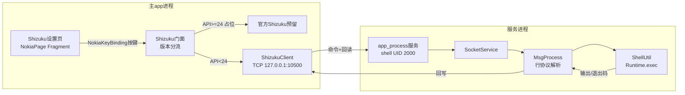

## 需求概述

在诺基亚桌面 Launcher 项目中复刻 RFMouse 的 client-server 架构，实现一个**通用的 shell 命令通道**，使应用进程能够以 shell 身份执行系统命令。

## 核心功能

- **复刻 RFMouse client-server 结构**：mini_shizuku 作为服务端（app_process 进程），主 app 作为客户端。
- **手动 adb 启动**：服务端由用户在开发机手动执行 `demon.sh` 启动，主 app 仅负责检测服务在线状态、展示并复制 adb 启动命令、测试连通。
- **Android 版本分流**：mini_shizuku 仅用于 Android 7 以下（API < 24）；Android 7.0+（API >= 24）本次不集成官方 Shizuku，客户端门面做版本分流并预留将来扩展点。
- **通用 shell 命令通道**：支持执行命令（静默执行 + 同步获取输出两种模式），供后续功能复用。
- **桌面设置入口**：在「桌面设置」中新增"Shizuku 服务"设置项，展示服务状态、adb 启动指引、执行命令测试，遵循诺基亚桌面按键导航/240dp 布局规范。


## 技术选型

- **语言**：Java（与项目一致，工程为 Groovy DSL Android 项目）
- **服务端**：现有 `mini_shizuku` 模块（app_process 以 shell/UID 2000 身份运行），复用 `AdbProcess → SocketService → MsgProcess → ShellUtil` 链路
- **客户端**：扩展现有 `ShizukuClient`（TCP 127.0.0.1:10500），补充带输出回显的执行方法
- **进程隔离**：保持 `:mini_shizuku` 作为独立 Gradle 库模块，服务端在独立 app_process 进程运行，崩溃不影响主 app
- **UI**：诺基亚桌面现有 Fragment 模式（`NokiaPage` + `NokiaFocusHost`），复用 `NokiaOptionsDialog`、`NokiaSettingsStorage`、`NokiaDimens.dp()`

## 实现方案

### 核心架构决策

1. **版本分流门面**：在 `Shizuku.java` 门面中新增版本判断，`Build.VERSION.SDK_INT < 24` 走 mini_shizuku；`>= 24` 返回不可用占位（为将来官方 Shizuku 留扩展接口）。主 app 一律通过 `Shizuku` 门面调用，不直接接触底层 client/server 类。

2. **命令回显扩展**：现有 `ShizukuClient.exec()` 只写入不读回显，无法获取输出。新增 `execWithOutput()`：客户端发送命令后读取服务端回写，服务端 `MsgProcess` 在 `ShellUtil` 执行后把标准输出/退出码写回 socket。需要设计简单的行协议（命令 → 输出行 → 结束标记），避免阻塞。

3. **服务检测与引导**：仿照 `isDefaultLauncher()` 的"检测状态 + 引导"模式，新增"Shizuku 服务"设置页，检测 TCP 端口在线性、显示 adb 启动命令（区分 debug/release 包名）、提供复制命令和测试连通功能。

4. **adb 启动命令来源**：服务启动命令（demon.sh 内容）以资源形式存放在主 app 内，供设置页展示/复制，避免硬编码散落。启动命令按当前构建类型区分包名（debug 为 `io.github.cctyl.nokia.debug`，release 为 `io.github.cctyl.nokia`）。

### 数据流



### 关键设计要点

- **协议设计**：客户端发送命令时区分「静默执行」与「等待输出」。静默模式沿用现有 `exec`；带输出模式需约定：客户端发命令 → 服务端执行 → 回写 stdout+stderr → 回写结束标记。为兼容 Android 4.4（MIN_SDK=14），避免使用 Java 8+ 特性，使用 `BufferedReader`/`OutputStream` 原生流。
- **服务端健壮性**：`ShellUtil` 需在输出回写时同步执行完成（`waitFor`），避免线程池线程被长时间占用的阻塞问题；为防资源泄漏，每条连接关闭时释放 socket。
- **性能**：TCP 通道为低频控制通道，并发极低，无需额外优化；命令执行走线程池（现有 `SocketService` 已用 1-3 线程 + 队列），避免阻塞连接监听。

## 实施注意（防止回归）

- **版本守卫**：项目 `MIN_SDK=14`，新增代码严禁出现无守卫的高版本 API；版本判断一律 `Build.VERSION.SDK_INT >= 24` 形式。
- **遵守诺基亚桌面规范**：新 Fragment 根布局宽固定 240dp、高度 match_parent；尺寸换算走 `NokiaDimens.dp()`；scale 走 `host.getScale()`；按键走 `NokiaKeyBinding` 语义动作（不能写死 keyCode）。
- **lint 约束**：`app/build.gradle` 已 `disable 'NewApi'` 等，但 mini_shizuku 模块的 lint 配置需确认，新增代码保持与现有风格一致。
- **不要改动 J2ME 兼容层**：本次改动仅在 `mini_shizuku` 模块和诺基亚包 `ru.playsoftware.j2meloader.nokia` 下，不影响 `javax.microedition.*`。
- **启动脚本保持**：`app/src/debug/assets/demon.sh` 与 `app/src/release/assets/demon.sh` 已存在且正确，无需改动；设置页展示的命令从这两个脚本内容派生。

## 目录结构

本次改动涉及 mini_shizuku 模块与诺基亚桌面设置页两部分。

```
mini_shizuku/src/main/java/ru/playsoftware/mini_shizuku/
├── Shizuku.java                      # [MODIFY] 门面：新增版本分流（API<24 mini_shizuku，>=24 占位），
│                                     #   新增 execWithOutput()，维护接口兼容（isRunning/exec 不变）
├── client/
│   └── ShizukuClient.java            # [MODIFY] 新增 execWithOutput()：发命令后读回显直到结束标记；
│                                     #   抽取私有 connect/send/read 辅助方法，保持 exec 兼容
└── server/
    ├── MsgProcess.java               # [MODIFY] 扩展行协议：识别「带输出」命令前缀，执行后把
    │                                 #   stdout/stderr 与退出码写回 socket，再发结束标记
    └── ShellUtil.java                # [MODIFY] 新增 execWithOutputAndCode()：执行并返回
                                     #   (输出, 退出码)，供 MsgProcess 回写；保留 execute 兼容

app/src/main/java/ru/playsoftware/j2meloader/nokia/
├── NokiaDesktopSettingsFragment.java # [MODIFY] ITEM_ICONS/ITEM_NAMES 新增"Shizuku 服务"项，
│                                     #   getItemDisplayName() 动态显示在线/离线状态，
│                                     #   onSelect() switch 打开 ShizukuFragment
└── ShizukuFragment.java              # [NEW] 实现 NokiaPage+NokiaFocusHost（8 方法）：
                                     #   展示服务状态、adb 启动命令（区分 debug/release）、
                                     #   复制命令、测试连通、执行简单测试命令

app/src/main/res/layout/
└── fragment_shizuku.xml              # [NEW] 240dp 宽布局：状态行、adb 命令显示框、
                                     #   复制/测试/执行按钮区，符合诺基亚软键导航

app/src/main/res/
├── drawable/ 或 mipmap/              # 可能需新增一个图标资源（如 s60_shizuku）用于设置项
└── strings.xml                        # 如需新增文案可复用现有 strings 或直接硬编码
```

## 关键代码结构

以下为跨模块依赖的核心契约，实现时需精确对齐。

**协议约定**（server 与 client 共享，未抽公共类以避免跨模块耦合，以注释形式在两端保持一致）：

```
客户端 → 服务端： "<EXEC>|<命令>\n"       // 静默执行（不读输出，兼容旧 exec）
                  "<EXEC_OUT>|<命令>\n"   // 带输出执行
服务端 → 客户端： 逐行回写 stdout/stderr
                  最后一行回写 "EXIT:<code>\n"   // 结束标记
```

**门面接口**（`Shizuku.java` 对主 app 暴露的契约，主 app 只依赖此门面）：

```java
public final class Shizuku {
    // API>=24 返回 false（本次不集成官方 Shizuku，占位）
    public static boolean isSupported();          // 版本是否在该通道支持范围内
    public static boolean isRunning();            // 服务是否在线（TCP 端口探测）
    public static boolean exec(String command);   // 静默执行（兼容现有）
    public static String execWithOutput(String command); // 执行并返回输出（超时保护）
}
```

**版本分流逻辑**：

```java
private static final int SHIZUKU_MIN_API = 24; // 官方 Shizuku 最低 API
public static boolean isSupported() {
    return Build.VERSION.SDK_INT < 24;          // mini_shizuku 仅用于 Android 7 以下
}
```

## 关键技术决策说明

- **不做跨模块公共协议类**：`mini_shizuku` 是被主 app 依赖的独立库，为保持其独立可复用，协议约定以注释形式双端保持一致，避免引入不必要的共享依赖。
- **回显用行协议 + 结束标记**：比"先读长度再读内容"的二进制协议更简单可靠，与现有 `readLine` 风格一致，且对 shell 输出天然兼容。
- **门面不直接抛异常**：网络失败返回空串/失败标志，由设置页统一呈现，避免破坏主 app 稳定性（与服务进程崩溃隔离一致）。
- **官方 Shizuku 预留**：仅保留 `isSupported()` 返回 false 的占位路径，不引入 Shizuku 库依赖，避免在 Android 7 以下设备上出现运行时类加载问题（shizuku-api 本身也要求 minSdk>=23 附近，需守卫）。


## Agent 扩展

### Skill
- **nokia-android-build**
  - 用途：在实现完成后构建 `assembleOpenDebug` 验证编译，处理国内网络下的 Gradle 依赖/镜像/签名问题。
  - 预期结果：能成功打出 Debug APK，验证 mini_shizuku 与诺基亚设置页改动编译通过。
- **android-cli**
  - 用途：如环境需要，使用 `android` 命令工具辅助 SDK/环境诊断。
  - 预期结果：构建环境就绪，无 SDK 缺失阻塞。

### SubAgent
- **code-explorer**
  - 用途：实现阶段如需精确定位诺基亚设置页数组、图标资源、现有 Fragment 布局风格的具体代码位置，可快速搜索确认。
  - 预期结果：拿到精确的文件行号/图标资源名/布局样式，避免盲改。

## TODOS

- [x] 扩展 mini_shizuku 服务端：ShellUtil 新增带输出+退出码执行方法，MsgProcess 支持带输出命令前缀并回写输出与结束标记
- [x] 扩展 ShizukuClient 新增 execWithOutput()（发命令并读回显至结束标记），并保证现有 exec 兼容
- [x] 扩展 Shizuku 门面：新增 isSupported() 版本分流（API>=24 走官方预留占位，<24 走 mini_shizuku）
- [x] 桌面设置新增「mini_shizuku」设置项：展示在线/离线状态、adb 启动命令、测试连通

## 正确执行路径（2026-08 实测，务必照此执行）

> 目标：在 Android 4.4 ~ 6.x 老手机上以 shell 身份启动 mini_shizuku 服务，使主 app 能执行系统命令。

### 前置：确认应用已安装且为含 mini_shizuku 服务的版本

1. **构建并安装应用**（debug 版带 `.debug` 后缀包名）：
   ```bash
   .\gradlew.bat assembleOpenDebug -x lint
   adb install -r app/build/outputs/apk/open/debug/J2ME_Loader-*-open-debug.apk
   ```
   > **必须使用最新构建的 APK**。旧 APK 可能因 multidex 拆分问题（见下方「已知坑」）导致服务无法启动。

2. **确认设备是 Android 7 以下**（`Shizuku.isSupported()` 只在 API < 24 时走 mini_shizuku）：
   ```bash
   adb shell getprop ro.build.version.sdk   # 19=4.4 / 21=5.0 / 22=5.1 / 23=6.0
   ```
   - SDK < 24：支持，按本流程执行
   - SDK >= 24：官方 Shizuku 未集成，设置页会显示不可用，无需启动服务

### 启动服务（两步命令）

在项目根目录执行（脚本文件为 `mini_shizuku.sh`，多设备必须带 `-s <serial>`）：

```bash
# 1. 推送脚本到设备
adb -s <serial> push mini_shizuku.sh /data/local/tmp/

# 2. 以 shell 身份启动服务
adb -s <serial> shell sh /data/local/tmp/mini_shizuku.sh
```

预期输出：`MiniShizuku started for io.github.cctyl.nokia.debug`

### 验证是否成功

方法一：进程存活检查
```bash
adb -s <serial> shell "ps | grep app_process"
# 应看到一条 app_process ... ru.playsoftware.mini_shizuku.server.AdbProcess
```

方法二：日志检查
```bash
adb -s <serial> shell cat /data/local/tmp/minishizuku.log
# 正常情况下为空或仅启动信息；若报 "could not find class" 说明 APK 缺 mini_shizuku 主 dex（见已知坑）
```

方法三：应用内检查
手机回到「桌面设置 → mini_shizuku」，状态应显示「在线」。

### 注意事项

- **手机重启后服务会停止**：重新执行上面两条命令即可（脚本已留在 `/data/local/tmp/`）。
- **包名自动识别**：脚本会先找正式版 `io.github.cctyl.nokia`，找不到再找调试版 `io.github.cctyl.nokia.debug`，无需手工指定。
- **多设备**：所有 adb 命令都要带 `-s <serial>`，避免误装/误操作其他设备。
- **无线设备掉线**：`adb connect <ip>:5555` 重连后设备列表会刷新，直接执行脚本即可。

## 已知坑：Android 4.4 Dalvik 只加载主 dex（multidex 拆分问题）

### 现象

Android 4.4（SDK 19，Dalvik VM）设备上执行启动脚本后：
- 日志 `/data/local/tmp/minishizuku.log` 报 `ERROR: could not find class 'ru.playsoftware.mini_shizuku.server.AdbProcess'` 后 abort
- 应用内 mini_shizuku 显示「离线」
- 但同 APK 在 Android 5+（ART）设备上一切正常

### 根因

1. 应用方法数超过 65536 触发 multidex，R8 将类拆分到 `classes.dex` / `classes2.dex` / `classes3.dex`；
2. 服务主类 `ru.playsoftware.mini_shizuku.server.AdbProcess` 被 R8 拆分到了 `classes3.dex`；
3. Android 4.4 的 Dalvik 通过 `app_process -Djava.class.path=<apk>` 启动时**只读取主 `classes.dex`**，不支持加载 multidex 的 secondary dex；
4. 于是找不到 `AdbProcess` → abort → 服务离线。
5. ART（Android 5.0+）的 app_process 支持完整 multidex，所以 Android 5+ 设备无此问题——这就是"高版本正常、4.4 挂掉"的差异来源。

### 修复：把 mini_shizuku 服务端类强制保留在主 dex

在 `app/multidex-config.pro` 增加 keep 规则（已添加，2026-08）：

```pro
# mini_shizuku 服务端：必须留在主 dex（classes.dex）。
# 原因：Android 4.4 的 Dalvik 通过 app_process -Djava.class.path=<apk> 加载时
# 只读取主 classes.dex，不支持 multidex 的 secondary dex（classes2/classes3）。
# 若服务端类（AdbProcess 等）被 R8 拆分到 classes2/3，则 app_process 报
# "could not find class ru.playsoftware.mini_shizuku.server.AdbProcess" 并 abort，
# 表现为 mini_shizuku 服务离线（Android 5+ 的 ART 无此问题）。
-keep class ru.playsoftware.mini_shizuku.server.** { *; }
-keep class ru.playsoftware.mini_shizuku.** { *; }
```

### 验证修复

构建后检查 APK 内 dex 分布，`AdbProcess` 必须出现在**主 `classes.dex`**：

```python
# 用 python 检查（Windows 直接运行）
import zipfile
z = zipfile.ZipFile(r'app/build/outputs/apk/open/debug/J2ME_Loader-*-open-debug.apk')
for dex in [n for n in z.namelist() if n.endswith('.dex')]:
    data = z.read(dex)
    print(dex, 'AdbProcess:', b'ru/playsoftware/mini_shizuku/server/AdbProcess' in data)
```

`classes.dex` 输出 `AdbProcess: True` 即修复生效。

### 排查要点（遇到离线先按此顺序）

1. `ps | grep app_process` —— 进程是否存在（不存在 → 启动失败）
2. `cat /data/local/tmp/minishizuku.log` —— 是否有 `could not find class`（有 → multidex 问题，重建 APK）
3. 用真实安装路径手动前台运行看报错：
   ```bash
   adb -s <serial> shell "path=$(pm path <pkg>); path=${path#package:}; app_process -Djava.class.path=$path /system/bin ru.playsoftware.mini_shizuku.server.AdbProcess"
   ```
4. 对比：同 APK 在 Android 5+ 设备上是否正常（正常 → 基本锁定 Dalvik 主 dex 问题）
5. 注意：`dalvik-cache` 不可写（`Dex cache directory isn't writable`）是另一类问题，通常出现在 APK 被复制到 `/data/local/tmp` 等非安装路径时；用真实安装路径（`pm path`）启动可走系统已生成的缓存，规避此问题