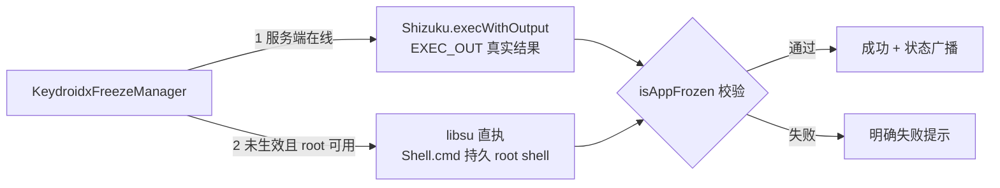

# 权限通道双轨制设计（root 模式与 mini_shizuku 模式）

> 关联文档：
> - `docs/mini_shizuku设计文档.md`（现有 shell 通道背景、`AdbProcess → SocketService → MsgProcess → ShellUtil` 链路）
> - `docs/电源键拦截方案设计.md`（拦截器常驻、`InterceptorNative` / `libnokiainterceptor.so`）
> - `docs/mini_shizuku输入注入快速通道设计方案.md`（`InputInjector` 快路径）
> - `../keydroidx-core/docs/NOKIA_DEVELOPMENT_RULES.md`（按键/排版/兼容硬性规则）
>
> **版本：v2 修订版（2026-09-26）**。v1 为方案审核稿；v2 吸收代码级审核的 6 点结论与用户拍板的 4 项决策，消除 v1 内部矛盾，确定实施范围。

---

## 0. TL;DR

把当前的"单一 mini_shizuku 通道（shell 身份）"重构为**两种互斥的授权模式**，由用户在桌面设置中选择：

| 模式 | 服务端身份 | 命令执行身份 | 需要 root | 定位 |
|---|---|---|---|---|
| **root 模式** | root（uid=0，启动早期补 inet 组） | **root**（服务端优先，libsu 兜底） | 是 | 功能最全，root 是 shell 的超集 |
| **mini_shizuku 模式** | shell（uid=2000） | **shell** | 否 | 兼容最好，无 root 设备电脑 adb 激活 |

核心原则：

> **有 root 的用户直接用 root 模式**——root 是最高权限，一切以 root 执行，不做降权。
> **mini_shizuku 模式只服务无 root 用户**（电脑 adb 激活），shell 做不到的操作（如 4.4 冻结）**直接失败并提示**，不静默、不假成功。
> **root 模式下冻结/解冻走"服务端优先 + libsu 兜底"的固定两级路由**——服务端在线先走 TCP（`EXEC_OUT|` 真实结果），未生效且 root 可用则 App 内 libsu root 直执，最终以 `isAppFrozen()` 真实状态为准。

双模式把"动态降级链"简化为"静态模式选择 + 冻结场景的固定两级路由"，绕开"动态判断 mini_shizuku 做没做到"的复杂判断。

### 0.1 v2 修订摘要（审核结论 + 拍板决策）

| # | 审核发现 | v2 结论 |
|---|---|---|
| 1 | v1 目标 6（"root 直执不走 TCP"）与 §3.2（所有命令走 TCP）自相矛盾 | **消除**：一次性命令（冻结/解冻）路由定为"服务端优先 + libsu 兜底"（§3.2、§5）；常驻能力（拦截、注入快路径）始终走服务端 |
| 2 | `nativeDropToShell` 降权拉起 shell 服务端的 exec 设计有误（嵌套 exec 复杂且无必要） | **整节砍掉**（原 v1 §5）：有 root 用户直接用 root 模式，mini_shizuku 模式只保留电脑 adb 激活 |
| 3 | `nativeSetSuppGroups` 是 JNI 方法，v1 未定义库加载时序 | **补充**：`prepareLibrary + loadLibrary` 必须在 `AdbProcess.main()` 最前完成，补组在任何网络操作之前调用；部署失败有明确降级行为（§4.2.1） |
| 4 | 模式选择 ≠ 服务真实身份（旧服务残留、激活失败会造成 UI 与实际不符） | **新增 WHOAMI 身份校验**：PING 扩展返回服务端 uid，UI 校验"所选模式 = 服务端真实 uid"（§3.4） |
| 5 | root 服务端泄露 K = 任意 root 命令执行（`ShellUtil.execute` 是通用 exec） | **root 模式服务端 EXEC 白名单**：只接受预定义模板命令（v2 初稿只列了冻结/解冻/注入；**2026-09-30 已扩为全量命令模板表**，见 §6.2） |
| 6 | v1 步骤 0 要写 app_process 测试程序，成本高 | **简化**：独立 ndk-build 测试二进制（~20 行 C）直接实测补组（§7 步骤 0） |

**用户拍板的 4 项决策**：
1. 一次性命令路由 = **服务端优先 + libsu 兜底**（4.4 + root 设备自动获得冻结能力，用户零手动切换）。
2. **砍掉 root 降权拉起 shell 服务端**（`nativeDropToShell` 删除）。
3. root 模式服务端 **EXEC 白名单**（防 K 泄露）。
4. 本轮交付 = **文档修订 + 步骤 0 验证 + 假成功修复**；服务端补组/白名单/WHOAMI 的代码实现属步骤 0 通过后的**下一阶段**。

### 0.2 v2.1 实测修订（2026-09-26 真机点击级验证）

adb 模拟真实 UI 点击 + 截图逐屏验证发现两处缺陷并修复，**root 直执通道由 libsu 整体替换为 `su -c` 直执**（`KeydroidxRootShell`）：

| # | 缺陷 | 根因 | 修复 |
|---|---|---|---|
| 1 | 点击「授权模式」即闪退 | `ShizukuFragment.onAction` 在**主线程**调用 `Shizuku.isRunning()`（TCP 探测）→ `NetworkOnMainThreadException` | 身份一致性校验移入后台线程（`checkServerIdentityMatch`） |
| 2 | 点击「root 激活」永久停留在"正在通过 root 激活..." | **libsu 5.2.2 在 4.4.4 + SuperSU v2.76 上 `Shell.newJob().exec()` 无限期挂起**：su 授权 GRANTED、脚本实际已执行（服务端都起来了）、但 exec() 收不到标记回显。持久 shell 创建成功、纯脚本 + FIFO 喂命令 + 标记回显经 adb 复现均正常，唯独 App 内 libsu exec() 必现挂死 | 新增 `nokia/KeydroidxRootShell`：脚本写 cache 文件 → `Runtime.exec(su -c sh <file>)` → 线程排空 stdout/stderr → 超时 destroy。真机实测：激活 4 秒内完成（退出码 0、补组 n=11、WHOAMI uid=0、模式同步 root） |

- `ShizukuRootFragment.startServerAsRoot / collectActivationDiagnostics / copyMinishizukuLog / isRootAvailable`、`KeydroidxFreezeManager.tryRootExecute / hasRootChannel` 全部改走 `KeydroidxRootShell`；SuperSU 策略对本应用为 grant 时无弹窗直通。
- 激活脚本尾部 `</dev/null` 重定向保留（防后台 app_process 持有 su stdin）。
- **教训：涉及 I/O 的 UI 回调必须后台线程；老设备 root 通道优先选用被实测验证过的 `su -c` 模式，而非引以为默认可靠的库。**

---

## 1. 背景与问题

### 1.1 当前架构（单通道）

当前所有特权操作（冻结/解冻应用、电源键拦截、输入注入等）都绑死在 mini_shizuku 这一条 TCP 通道上：

```
app ──TCP 127.0.0.1:10500──▶ mini_shizuku 服务端（app_process）
                                    │
                                    ├─ MsgProcess.dispatch()
                                    ├─ ShellUtil.execute()  ← 进程身份执行命令
                                    ├─ InputInjector        ← 输入注入快路径
                                    └─ InterceptorNative    ← 电源键拦截常驻
```

服务端 `app_process` 的身份 = 启动它的 shell 的身份：
- **adb 激活**（`mini_shizuku.sh`，电脑 + USB）：shell 用户（uid=2000）
- **root 激活**（`ShizukuRootFragment`，libsu `Shell`）：root（uid=0）

### 1.2 实测暴露的三个问题

#### 问题 A：root 激活 mini_shizuku 起不来（inet 组缺失）

设备：Android 4.4.4 / SDK 19，SuperSU v2.76，SELinux Enforcing。

root 激活日志（实测）：
```
I/MiniShizuku: MiniShizuku server starting...
I/MiniShizuku: ServerEnv ready: host=io.github.cctyl.nokia authority=...
E/MiniShizuku: SocketService start failed
E/MiniShizuku: java.net.SocketException: socket failed: EACCES (Permission denied)
    at libcore.io.Posix.socket(Native Method)
    at ...SocketService.bindWithTakeover(SocketService.java:3)
E/MiniShizuku: exiting app_process due to SocketService failure
I/ShizukuRoot: root 激活结果: online=false execOk=true
```

身份对照（实测 `id`）：
```
adb shell id         → uid=2000(shell) gid=2000(shell)
                        groups=1004(input),1007(log),1011(adb),1015(sdcard_rw),
                                1028(sdcard_r),3001(net_bt_admin),3002(net_bt),
                                3003(inet),3006(net_bw_stats)  ← 有 inet 组
                        context=u:r:shell:s0

adb shell su -c id   → uid=0(root) gid=0(root)            ← 无任何补充组！
                        context=u:r:init:s0
```

**成因**：Android 内核对 `socket()` 创建的访问控制是**检查进程的 supplemental groups 里有没有 `inet` 组（gid 3003）**，而不是检查 uid 是否为 0。SuperSU v2.76 拉起的 root 进程只给了 `uid=0/gid=0`，没给任何补充组（包括没给 3003），于是 root 跑的 app_process 在 `new ServerSocket(10500)` → `socket()` 时被内核 `EACCES` 拒绝，服务 `System.exit(1)` 退出。

> ⚠️ **误报陷阱**：第一次激活日志可能显示 `online=true`，那是上一轮 adb 服务还没被 kill，`Shizuku.isRunning()` 轮询命中了旧服务。root 脚本 `kill -9 app_process` 杀掉旧 adb 服务后，新 root 服务起不来，后续全是 `online=false`。
>
> ⚠️ root 有 `CAP_SETGID`，完全可以 `setgroups()` 给自己补 inet 组。这不是硬障碍，是服务端启动早期需要主动补（§4）。

#### 问题 B：冻结应用"假成功"

设备同上，adb 激活后冻结 `com.example.keymappermouse`。

客户端日志：
```
I/KeydroidxFreezeManager: executeFreeze: com.example.keymappermouse
I/MiniShizuku: exec(silent): am force-stop ... ; pm disable-user --user 0 ... || pm hide ...
I/KeydroidxFreezeManager: 已通过 mini_shizuku 执行冻结: com.example.keymappermouse res=true
```

实际状态（实测 `dumpsys`）：
```
User 0: installed=true blocked=false stopped=true notLaunched=false enabled=0
                                                                  ^^^^^^^^^^
                                                                  0 = DEFAULT（没被 disable）
pm list packages -d | grep keymappermouse  → 空（没进 disabled 列表）
```

只有 `am force-stop` 生效了（`stopped=true`），`pm disable-user` **静默失败**（状态没变）。

**双重根因**（实测对照）：

| 身份 | 命令 | 输出 | 结果 |
|---|---|---|---|
| shell（adb） | `pm disable-user --user 0 <pkg>` | （空） | ❌ enabled=0 DEFAULT，没生效 |
| shell（adb） | `pm hide <pkg>` | `unknown command 'hide'` | ❌ Android 4.4 没这命令（7.0+ 才有） |
| **root** | `pm disable-user --user 0 <pkg>` | `new state: disabled-user` | ✅ enabled=3，进 `-d` 列表 |
| **root** | `pm disable <pkg>` | `new state: disabled` | ✅ enabled=2，更彻底 |

即：在 Android 4.4.4 这台设备上，**shell 用户执行 `pm disable-user` 是静默失败的**（没有报错输出，但状态根本没改），而 **root 能冻住**。

而客户端 `Shizuku.exec()`（对应服务端 `EXEC|` 静默前缀）的实现是"连上 + 发出去即 `return true`"，服务端 `MsgProcess` 对 `EXEC|` 也**不回写结果**（只有 `EXEC_OUT|` 才回 `EXIT:<code>`）。于是 `pm disable-user` 真报错，客户端照样报成功。

#### 问题 C：root 没有独立执行路径

`KeydroidxFreezeManager.executeFreeze()` 只有一条 mini_shizuku 路径 + 一条 DevicePolicyManager（需设备所有者，老手机一般没设）路径。**没有"root 直执"这条路**。冻结这种 root 本可一步到位（`pm disable` 拿真实 `new state:` 输出）、shell 在 4.4 根本没权限的操作，被绑死在 shell 通道上，于是注定失败。

### 1.3 问题归因

三个问题同源：**当前是"单通道、单身份"设计，root 只被当成"adb 的换身份版"，没发挥 root 的超集能力，反而继承了服务端对 shell 用户特权的隐性依赖（inet 组、shell 的 pm 权限）。**

---

## 2. 设计目标

1. **root 模式可用性**：有 root 的设备，root 一定能激活 mini_shizuku 服务端（root 身份，补 inet 组），所有命令以 root 权限执行，功能最全（含电源键拦截等常驻能力）。
2. **mini_shizuku 模式兼容性**：无 root 设备也能用（电脑 adb 激活），shell 能做的命令都能做；shell 做不了的操作（如 4.4 冻结）直接失败并提示。
3. **不假成功**：任何"必须确认结果"的操作（冻结/解冻）必须读到真实执行结果，并以真实状态（`isAppFrozen()` 等）校验，不允许"命令发出即成功"。
4. **职责清晰**：两种模式互斥，命令执行身份唯一、可预测；模式选择由用户在设置页做出。冻结/解冻的路由是**固定两级**（服务端 → libsu），不是任意操作的动态降级链。
5. **复用最大化**：root 模式复用现有 mini_shizuku 服务端 + 拦截器整套代码（服务端以 root 身份跑即可），不另起一套常驻承载。
6. **安全边界**：
   - root 模式服务端 **EXEC 白名单**：root 服务端一旦泄露 K，等价于"任意 root 命令执行"，因此服务端只接受 §6.2 **全量登记**的命令模板（命令骨架 + 受限参数占位），见 §6。
   - libsu 兜底路径在 App 进程内直执，不走 TCP、不需要 K 鉴权，靠"app 已获 root 授权"本身；命令同样走模板替换 + 白名单。

> **v1 矛盾消除说明**：v1 目标 6 说"root 直执不走 TCP"，与 §3.2"所有命令走 TCP"矛盾。v2 明确为：**常驻能力（拦截、注入快路径）始终走服务端；一次性命令（冻结/解冻）服务端优先、libsu 兜底**。libsu 是风险隔离与可达性兜底，不是能力缺失的补偿（root 身份服务端在 4.4 能冻结，实测已验证）。

---

## 3. 方案总览

### 3.1 双模式定义

```
┌───────────────────── 桌面设置 → 授权模式（单选）────────────────────┐
│                                                                  │
│  ○ root 模式                                                     │
│    服务端以 root 身份运行（启动早期补 inet 组后 TCP 可起）          │
│    冻结/解冻：服务端优先（EXEC_OUT 真实结果）+ libsu root 兜底      │
│    常驻能力（拦截/注入快路径）：始终走服务端（root）               │
│    功能最全；需要 root                                            │
│                                                                  │
│  ○ mini_shizuku 模式（默认）                                      │
│    服务端以 shell 身份运行（电脑 adb 激活）                        │
│    所有命令以 shell 权限执行                                      │
│    兼容最好；无 root 设备唯一可用模式                              │
│    shell 做不了的操作（如 4.4 冻结）直接失败并提示"请切 root 模式"  │
│                                                                  │
└──────────────────────────────────────────────────────────────────┘
```

### 3.2 各模式数据流

**root 模式**：
```
激活：桌面内 root 激活（libsu Shell 拉起 app_process，main() 最早补 inet 组）

冻结/解冻（一次性命令，固定两级路由）：
  ① 服务端在线 → Shizuku.execWithOutput(模板) → EXEC_OUT| 回真实结果 → isAppFrozen() 校验
  ② 未生效 且 root 可用（Shell.isAppGrantedRoot()==TRUE）→ libsu Shell.cmd(模板) 直执
     → stdout（new state: ...）+ 退出码 + isAppFrozen() 双重校验
  ③ 均未生效 → 明确失败提示

常驻能力：
app ──TCP 10500──▶ mini_shizuku 服务端（app_process, uid=0 + 补 inet 组）
                       ├─ MsgProcess.dispatch()  → ShellUtil.execute()  (root, 白名单)
                       ├─ InputInjector           (root，可写 /dev/uinput)
                       └─ InterceptorNative       (root，可强 grab /dev/input)
```

**mini_shizuku 模式**：
```
激活：电脑 adb shell sh mini_shizuku.sh（无 root 用户的唯一路径；v2 起不做 root 降权拉起）

app ──TCP 10500──▶ mini_shizuku 服务端（app_process, uid=2000）
                       ├─ MsgProcess.dispatch()  → ShellUtil.execute()  (shell)
                       ├─ InputInjector           (shell，仅消费模式)
                       └─ InterceptorNative       (shell，EVIOCGRAB 可用但 uinput 回放受限)

冻结/解冻：仅走服务端（EXEC_OUT）；4.4 下 shell 冻结注定失败 → ③ 明确提示"请切 root 模式"
```



### 3.3 模式选择的产品约定

- **默认 mini_shizuku 模式**：保证开箱即用、兼容最广。
- **用户可在设置页切换**：切到 root 模式需设备已 root 且 app 已获 su 授权。
- **能力差异提示**：mini_shizuku 模式下 shell 做不了的操作（如 4.4 冻结）**直接失败并提示"当前模式不支持，请切换到 root 模式"**，不静默、不假成功。
- **失败兜底不含糊**：root 模式下两级路由都失败时，同样明确失败提示（含两级各自的失败原因），不允许静默。

### 3.4 身份校验：模式选择 ≠ 服务真实身份（v2 新增）

风险：用户选了 root 模式，但服务端实际是旧 adb 残留的 shell 服务（误报陷阱，§1.2 问题 A），或 root 激活实际失败——UI 显示与真实身份不符，命令以错误身份执行。

**对策**：PING 协议扩展一个 `WHOAMI` 能力——服务端在 PING 响应（或独立 `WHOAMI|` 消息）中返回 `getuid()`/`geteuid()`。客户端在激活完成与模式切换时校验：

| 所选模式 | 服务端返回 uid | 判定 |
|---|---|---|
| root 模式 | 0 | ✅ 一致 |
| root 模式 | 2000（或其他） | ❌ 提示"服务端身份与所选模式不符，请重新激活" |
| mini_shizuku 模式 | 2000 | ✅ 一致 |
| mini_shizuku 模式 | 0 | ❌ 提示重连/重激活（不应出现，防御性校验） |

> WHOAMI 属步骤 0 通过后的下一阶段实现（随服务端补组一起做），本轮只定协议与判据。

---

## 4. 关键技术点 1：root 模式下让 root 身份的服务端起来（补 inet 组）

这是整个方案唯一的技术验证点。**原理上一定可行**（root 有 `CAP_SETGID`），落地只需在服务端启动早期主动补组。

### 4.1 为什么 root 默认缺 inet 组

SuperSU v2.76 的 `su` 拉起的进程只给 `uid=0/gid=0`，不带任何 supplemental group。Android 内核的 `socket()` 创建权限检查 supplemental groups 是否含 `inet`(3003)，**不检查 uid 是否为 0**。所以 root 进程没补组时 `socket()` → `EACCES`。

### 4.2 补组实现

在服务端 `app_process` 启动最早阶段（`AdbProcess.main()` 头几行，在任何网络操作之前）调 native `setgroups()` 补全组：

```c
// InterceptorNative.cpp 新增（或单独一个 native helper）
JNIEXPORT void JNICALL
Java_ru_playsoftware_mini_1shizuku_server_ServerPrivileges_nativeSetSuppGroups(JNIEnv*, jclass, jintArray gids) {
    jsize n = (*env)->GetArrayLength(env, gids);
    jint* arr = (*env)->GetIntArrayElements(env, gids, NULL);
    setgroups(n, (gid_t*)arr);   // root 有 CAP_SETGID，必成功
    (*env)->ReleaseIntArrayElements(env, gids, arr, JNI_ABORT);
}
```

补的组列表（与 shell 用户一致 + root 自己）：
```
0 (root), 1004(input), 1007(log), 1011(adb), 1015(sdcard_rw),
1028(sdcard_r), 3001(net_bt_admin), 3002(net_bt), 3003(inet),
3006(net_bw_stats), 9997(everybody)
```

> 用 native `setgroups(2)` 而非 Java 反射 `libcore.io.Os`：① 拦截器已有 native 库（`libnokiainterceptor.so`），加一个 JNI 方法成本极低；② 不依赖 4.4 的 `libcore.io.Os` 是否暴露 `setgroups`；③ `setgroups(2)` syscall 在 4.4 一定存在。

#### 4.2.1 库加载时序（v2 新增，审核点 3）

`nativeSetSuppGroups` 是 JNI 方法，**调用前 native 库必须已加载**。时序约束：

```
AdbProcess.main():
  1. ServerEnv / 日志初始化
  2. prepareLibrary(context) + System.loadLibrary(...)   ← 必须最前完成
  3. ServerPrivileges.nativeSetSuppGroups(GIDS)          ← 任何网络操作之前
  4. SocketService.bindWithTakeover(10500)               ← 此刻 socket() 才能成功
  ...
```

- `prepareLibrary`（从 APK 释放/部署 so）+ `loadLibrary` 必须在 `main()` 头部完成，不能延后到"用到拦截器时才加载"（v1 隐含的时序是错的）。
- **部署失败降级定义**：若 so 部署或加载失败——
  - **root 模式**：`nativeSetSuppGroups` 调不了 → 后续 `socket()` 必 EACCES → 服务端启动失败退出，日志明确报"补组失败（native 库不可用）"，不静默重试。客户端激活流程显示失败。
  - **mini_shizuku 模式**：shell 自带 inet 组，**不调补组**，不受影响。

#### 4.2.2 K 鉴权兼容 root（零改动说明）

`KeydroidxShizukuProvider.isPrivilegedUid` **已放行 uid=0**，root 身份服务端通过 K 鉴权无障碍，本轮零改动。此节仅作确认记录。

### 4.3 唯一要实测的一个点：SELinux

补组是 100% 能成。但 root 进程的 SELinux context 是 `u:r:init:s0`（Enforcing）。之前日志的 `EACCES` 有两种可能成因，光看异常分不清：

1. **缺 inet 组**（Android 内核组检查）——补组后解决。
2. **SELinux `init:s0` 域不允许 `socket create`**——补组不解决，要切 context。

**区分方法**：步骤 0 的独立 native 测试二进制实测（§7），比 v1 的"写 app_process 测试程序"简单得多：
- 补组后 socket 成功 → 成因 1，方案落地无障碍。
- 仍 `EACCES` + `dmesg` 有 `avc: denied { create }` → 成因 2 也在，需切 context。

**SELinux 兜底**（若成因 2 存在）：SuperSU 的 `su` 支持 `-cn, --context`，激活脚本里 `su -cn u:r:shell:s0` 切到 shell context（shell 域一定有 socket 权限）。切 context 不影响 root uid，仍保 root 权限。

#### ✅ 实测结论（2026-09-26，4.4.4 真机，步骤 0 通过）

独立 ndk-build 测试二进制（`step0_test/`，`setgroups → socket → bind` 逐步打印，支持端口参数）实测：

```
# root 身份（su -c /data/local/tmp/step0_test 10500）
setgroups(10 gids incl. 3003 inet): ret=0  ok    ← CAP_SETGID 生效
socket(AF_INET, SOCK_STREAM):       fd=4  ok    ← 之前 root EACCES 的正是这一步
bind(0.0.0.0:10500):                ret=0 ok    ← 真实服务端口，完整通过
RESULT: PASS

# 对照：shell 身份（基线）
setgroups: ret=-1 EPERM（无 CAP_SETGID，预期内）；socket ok（shell 自带 inet 组）

# 对照：root 补组前（§1.2 问题 A 原始故障）
socket failed: EACCES ← 唯一缺失的就是组
```

- **成因确认 = 缺 inet 组**：补组后 root 在 `u:r:init:s0` context 下 socket 创建与 bind 全部成功，无需任何其他改动。
- **SELinux 不参与**：`dmesg` 无任何针对 `AF_INET socket { create }` 的 `avc: denied`（仅有 permissive 模式下无关的 unix_stream_socket 记录）。`su -cn u:r:shell:s0` 兜底方案**不需要启用**。
- 排错备注：测试中 `bind(10501)` 曾报 `EADDRINUSE`，排查 `/proc/net/tcp6` 发现是设备上 uid 10082 的无关应用监听 `127.0.0.1:10501`（IPv4-mapped 未设 V6ONLY）所致——端口占用问题，与权限无关；换真实服务端口 10500 后完整通过。
- **结论：§4.2 补组方案落地无障碍**，root 身份服务端的 `SocketService.bindWithTakeover(10500)` 可以起来，步骤 2（服务端补组/白名单/WHOAMI）可以开工。

#### ⚠️ 实施补充（2026-09-26，步骤 2 落地时发现的第二个坑：SELinux 域限制文件访问）

真机联调发现：SuperSU 默认 context=`u:r:init:s0` 下，**root 身份的 app_process（Java 进程）无法访问 `/data/local/tmp` 下的文件**——`File.exists()` 对已存在文件返回 false、`FileOutputStream` 创建报内核 EACCES（步骤 0 的 native 测试二进制不受影响，它只做 setgroups/socket/bind，不碰文件系统）。表现为：

```
E/MiniShizuku: prepareLibrary: failed to extract library
E/MiniShizuku: java.io.FileNotFoundException: /data/local/tmp/libnokiainterceptor.so:
               open failed: EACCES (Permission denied)   ← root 身份！
```

而 **root shell（`touch`/`cat`）在同一 context 下可以写 `/data/local/tmp`**，shell 域（`u:r:shell:s0`）的 app_process 也一切正常。落地对策（均已实施并实测通过）：

1. **so 部署上移到激活脚本**：App 侧从 APK 解出最新 `libnokiainterceptor.so` 到 cacheDir，root 激活脚本用 `cat` 重定向部署到 `/data/local/tmp` 并 `chmod 755`（root shell 可写，规避 root Java 进程的域限制；同时保证服务端加载的永远是当前 APK 的 so 版本）。
2. **app_process 用 `su -cn u:r:shell:s0` 切 shell 域拉起**（SuperSU `-cn` 切 context，**root uid 与 CAP_SETGID 保留**）：`su -cn u:r:shell:s0 -c "trap '' 1; app_process ... &"`。切域后 so 加载、K 鉴权、TCP 监听全部正常，补组实测成功（`/proc/<pid>/status`：Uid=0，Groups 含 3003）。
3. 服务端 `prepareAsRoot` 降级定义修正：库已存在 → 直接加载；不存在 → 尝试自行部署（预期失败）→ 加载失败才退出。

**最终实测（4.4.4 真机，root 激活）**：`Uid: 0`、`Groups: 0 1004 1007 1011 1015 1028 3001 3002 3003 3006 9997`（与 `SERVER_SUPP_GROUPS` 完全一致）、`Listening on 127.0.0.1:10500`、WHOAMI 返回 `OK:uid=0`。

### 4.4 激活流程（root 模式，✅ 已按此实施）

```
KeydroidxShizukuActivator.execRootStartScript()（ShizukuRootFragment 与设置页一键激活共用同一份）
  → App 侧从 APK 解出最新 libnokiainterceptor.so 到 cacheDir（root Java 进程无权写 /data/local/tmp）
  → KeydroidxRootShell.exec()：脚本写 cache 文件后 su -c sh <file> 直执，脚本：
       kill 旧 app_process
       cat <cache>/libnokiainterceptor.so > /data/local/tmp/libnokiainterceptor.so; chmod 755
       按候选表探测服务端日志路径（见 §4.5），echo "SERVER_LOG=<选中路径>"
       su -cn u:r:shell:s0 -c "trap '' 1; app_process -Djava.class.path=<apk> \
           -Dapp.package=<pkg> /system/bin ru.playsoftware.mini_shizuku.server.AdbProcess \
           >> "<选中路径>" 2>&1 </dev/null &"
       （-cn 切 shell 域：规避 init:s0 域对 /data/local/tmp 的访问限制，root uid 保留）
  → app_process main() 最早：
       lib 存在 → loadLibrary；InterceptorNative.nativeSetSuppGroups(GIDS)  ← 补 inet 组
       （之后 SocketService.bindWithTakeover(10500) 才 socket() 成功）
  → 轮询 Shizuku.isRunning() → true → WHOAMI 校验 uid==0（§3.4）
```

与 §4.3 之前的区别：激活脚本增加 so 部署与 `su -cn` 包裹；`AdbProcess.main()` 头部加载库 + 补组。服务端协议、拦截器、客户端协议不动。

### 4.5 实施补充（2026-09-30：让"起不来"必须留下现场）

背景：2026-09-29 21:23:54 的自动上报（Android 4.4.2 / MT6572 / alps V6）正文完全为空——
`root activation failure diagnostics (exit 0):` 后面什么都没有，附件里也没有 `minishizuku_*.log`。
复核结论：那次跑的是 **1.3.2（09-12 发布）**，即 §4.3 之前的形态，三处缺陷叠加导致"失败且零现场"：

1. **服务端日志写死 `/data/local/tmp`（1.3.2）**：固定名写不动时只退到 `/data/local/tmp/minishizuku.<uid>.log`
   ——**仍在同一目录**。一旦该目录不可写（SELinux 域/被别的 uid 以不可覆盖的标签占用），
   `app_process ... >> "$LOG"` 的重定向就打不开，`app_process` 根本不启动；而命令以 `&` 后台化，
   脚本**照样 exit 0**。→ 现改为候选表：`/data/local/tmp/minishizuku.log` →
   `/data/local/tmp/minishizuku.<uid>.log` → **App 自身日志目录下的 `minishizuku_server.log`**（该目录
   随自动上报 zip 一起上传，是唯一"不依赖复制也能寄回"的位置）→ 全不可写则退 `/dev/null`
   （宁可没有日志，也必须把服务端拉起来）。
2. **启动脚本零回显（1.3.2 走 libsu，stdout 拿不到）**：现由 `su -c` 直执并回显
   `SERVER_LOG=<选中路径>`；**刻意不在关键路径加 `sleep` 自证块**——那会吃掉 `KeydroidxRootShell`
   15 秒超时预算，在慢设备上把"服务端其实起来了"误判成 exec 超时。
   "启动后进程在不在/日志写了什么"交给失败后 20 秒运行的诊断（`collectActivationDiagnostics`）。
3. **诊断正文被截断**：「待上传」标记只留 detail 前 200 字符、上报注释只留前 160 字节（UTF-8），
   而现场有上百行。现按预算排序输出：`proc= / listen10500= / enforce=` → `wlog=c1|c2|c3|none`
   （同一份候选表里哪个真能写，**真实建文件探针**，不用 `[ -w ]`：root 的 DAC 判定会掩盖 SELinux 拒绝）
   → `tail=`（服务端日志最后两行）；候选完整路径与各自 tail 80 放详述块，随当天日志一起上传。
   另：`logcat -d -t 500` 在 4.4 上取不到内容，现已加回退 `logcat -d | grep -i minishizuku`
   ——服务端 Java 层错误（`socket failed: EACCES` / `UnsatisfiedLinkError`）只进 logcat、不落日志文件。

同批加固（与 09-26 的补组修复无关，属长期存在的缺陷）：

- **服务端 bind 补 `SO_REUSEADDR`**（`SocketService.bindWithTakeover` → 新增 `bind()`）：
  `new ServerSocket(10500)` 不带该选项，TIME_WAIT 压着本地端口时新实例直接 `BindException` →
  `System.exit(1)` → 20 秒全程离线；而启动脚本第一句 `kill -9` 掉的正是刚被 App 探活连过的旧实例，
  等于自己制造这个窗口。与 App 内 10501 的 `KeydroidxLockServer` 是同一类问题（见
  `docs/保活与高耗电排查方案.md` A4 行）。
- **激活入口互斥**：启动脚本会 kill 掉**所有** `app_process`，两次激活并发必然互相拆台。
  2026-09-28 日志里 20:25:32.704 与 20:25:36.698（以及 20:26:48.619/20:26:54.559/20:27:03.549）
  两次/三次并发，双双在 20 秒后判失败。现由 `KeydroidxShizukuActivator.tryLockActivation()`
  串行化，等待期间再点只提示"正在激活中"。

---

## 5. 关键技术点 2：读真实结果，消灭"假成功"（含 libsu 兜底路由）

这是**任何模式都要修的前置 bug**，也是双模式能正确工作的前提。**本轮实施**。

### 5.1 问题回顾

`Shizuku.exec()`（`EXEC|` 静默前缀）不读服务端结果，命令发出即 `return true`。4.4 下 shell `pm disable-user` 静默失败时，客户端报成功、UI 提示成功、应用没冻住。

### 5.2 修复原则：必须校验真实状态

对冻结/解冻，改用 `Shizuku.execWithOutput()`（服务端 `EXEC_OUT|` 回 `EXIT:<code>` + stdout），**且 exit code 也不够**（4.4 shell 下 `pm disable-user` 静默失败 exit 可能也是 0），必须以执行后的真实状态为准：

| 操作 | 成功判据（不只看 exit code） |
|---|---|
| 冻结 | `isAppFrozen()`（`ApplicationInfo.enabled` ∈ {2,3}，即 disabled） |
| 解冻 | `isAppFrozen()` == false（`enabled` == 1） |
| force-stop | exit 0（无输出，足够） |
| uinput 回放 | 按事件序列写入返回值判断 |

### 5.3 固定两级路由（root 模式冻结/解冻）

```
freeze(pkg) / unfreeze(pkg):
  0. 包名白名单校验 ^[a-zA-Z0-9_.]+$，失败直接拒绝
  1. 服务端在线 → Shizuku.execWithOutput(模板)
       → isAppFrozen() 符合预期 → 成功（+ 状态广播）
  2. 未生效 且 root 可用（Shell.isAppGrantedRoot()==TRUE，SDK≥19 守卫）
       → libsu Shell.cmd(模板)（持久 root shell，复用 ShizukuRootFragment.ensureRootShell 模式）
       → stdout（new state: ...）+ 退出码 + isAppFrozen() 双重确认 → 成功
  3. 否则 → 明确失败：
       - mini_shizuku 模式 + 4.4 冻结 → "当前模式不支持冻结，请切换 root 模式"
       - 其他 → 列出两级各自失败原因（服务端输出 / root 输出 / 状态校验结果）
```

要点：
- **libsu 是兜底而非替代**：服务端在线优先走 TCP（保持命令审计、与常驻能力同一通道）；服务端离线或执行未生效才动用 App 内 root shell。4.4 + root 设备即使不激活服务端也能冻结。
- **libsu 执行复用 `ShizukuRootFragment.ensureRootShell()` 的成熟模式**：缓存 shell 复用、non-root 时重建缓存；持久 shell 单命令开销毫秒级，低频操作无感知。
- **禁止任意拼接**：命令一律模板替换 + 包名白名单正则，两条通道同规。
- `catch` 分支按 `KeydroidxLog` 日志规范补 `e/w` 级别日志。

### 5.4 命令模板与成功判据表（按 Android 版本分流，v2 新增）

| 操作 | 通道 | 4.x（含 4.4） | 7.0+ | 成功判据 |
|---|---|---|---|---|
| 冻结 | root（服务端或 libsu） | `pm disable <pkg>`（实测 enabled=2 生效） | `pm disable-user --user 0 <pkg>` | `enabled` ∈ {2,3} |
| 冻结 | shell（服务端） | ❌ 不支持（shell 无权，静默失败）→ 明确失败提示 | `pm disable-user --user 0 <pkg>` | `enabled` ∈ {2,3} |
| 解冻 | root | `pm enable <pkg>` | `pm enable <pkg>` | `enabled` == 1 |
| 解冻 | shell | 仅 `pm enable <pkg>` | `pm enable <pkg>` + `pm unhide <pkg>` | `enabled` == 1 |
| force-stop | 双通道 | `am force-stop <pkg>` | 同左 | exit 0 |

> `pm hide` / `pm unhide` / `pm default-state` 在 4.4 均不存在，模板按 `Build.VERSION.SDK_INT` 分流选取，不做运行时尝试链。

### 5.5 客户端协议层

现有 `EXEC_OUT|` 已支持回写 stdout + `EXIT:<code>`（`MsgProcess.handleExecWithOutput` / `ShellUtil.execWithOutputAndCode`），`Shizuku.execWithOutput` 门面已存在，**无需改协议**。只需把 `executeFreeze`/`executeUnfreeze` 从 `Shizuku.exec()`（静默）切到 `execWithOutput` + 状态校验 + libsu 兜底。

### 5.6 v2.2 修订（2026-10-09 真机）：通道门禁收紧 + 批量单次 su

**现象**：root 模式（服务端 uid=0）+ 一键冻结之后，root 管理器连续弹出「已授予 xxx root 权限」。
该提示**不是"重新申请授权"**——root 管理器对**每一次新起的 `su` 进程**都会提示一次，
与授权策略是否早已 grant 无关（一次 `su` = 一次提示）。

**真机证据**（Q968 / Android 13 / `20261009.log`，10:32 一键冻结，名单 36 个包）：

| 项 | 次数 |
|---|---|
| 服务端冻结成功 | 21 |
| 服务端冻结未生效（`java.lang.IllegalArgumentException: Unknown package`，名单中的包在本机并不存在） | 14 |
| **root 直执（每个包一次 `su -c`）** | **14** |

即：14 个幽灵包各白起一次 `su` → 14 次授权提示。

**三条修订规则（`KeydroidxFreezeManager`）**：

1. **服务端身份只探测一次，作为兜底门禁**：`Shizuku.serverUid()`（WHOAMI）结果
   0=root / 2000=shell / -1=离线或无法确认（旧版服务端不认识 WHOAMI 时，
   root 模式回退 `Shizuku.isRunning()` 探活；mini_shizuku 模式一律不尝试，
   避免命中身份未知的服务端而破坏双轨制契约）。
2. **服务端是 root 身份时，不再走 root 直执兜底**：
   `isRootFallbackAllowed(uid) = isRootMode() && uid != 0`。服务端本身已是 root 通道，
   同一条命令、同一身份重跑一遍必然同样失败，只会多起一次 `su`、多弹一次提示。
   服务端离线（-1）或为 shell 身份（2000）时仍保留兜底（合理且必要）。
3. **包存在性预检 + 批量合并**：
   - `isPackageInstalled()`（`getApplicationInfo` + `MATCH_UNINSTALLED_PACKAGES|MATCH_DISABLED_COMPONENTS`；
     `NameNotFoundException` 视为"不存在"；已冻结/停用的包不会被误判）在单包与批量路径
     下发命令**之前**预检。名单里的残留条目（应用已卸载 / 来自其它设备的导入项）直接跳过：
     跳过数量**只记日志**（`freezeAll: 跳过本机不存在的包: <pkg>`），完成提示保持
     「已一键冻结 S/T 个应用」——残余名单属既有数据，不必每次操作都提醒用户（2026-10-09 用户要求；
     名单项**不做自动清理**，由用户自行决定是否移出）。仅当名单项全部不存在时才提示
     「冻结名单中的 N 个应用在本机均不存在」。
   - `freezeAll`/`unfreezeAll` 整批只探测一次服务端身份；服务端不可用且为 root 模式时，
     整批命令合并为一个脚本、**一次 `su`** 执行（`rootExecuteBatch`，超时 = 8s + 3s/包，上限 60s），
     随后逐包 `isAppFrozen` 实测校验。服务端在线时仍逐包走 TCP（不弹 `su`）。
     服务端白名单（§6.2）本就支持 `;` 拼接的批量命令，无需改服务端。

**回归验证（2026-10-09，同一设备）**：修复后连续两次一键冻结，均只产生 14 条
`freezeAll: 跳过本机不存在的包`、`root 直执` 新增 **0** 次、无任何 `su` 调用，授权提示不再连续弹出。
同日二次验证（提示文案调整）：完成提示实测为「已一键冻结 22/22 个应用」，不再包含跳过数量。

> 与 §5.3 的关系：两级路由本身不变（服务端优先 + 真实状态校验），只是把"root 兜底"的触发条件
> 从"处于 root 模式"收紧为"root 模式 **且** 服务端不是 root 身份"。

---

## 6. 关键技术点 3：root 模式服务端 EXEC 白名单（v2 新增）

### 6.1 为什么必须做

root 服务端泄露 K（鉴权密钥）的后果 = **任意 root 命令执行**：当前 `MsgProcess.dispatch()` → `ShellUtil.execute()` 是通用 exec，任何拿到 K 的本地进程都能让 root 服务端跑任意 shell 命令。shell 身份服务端泄露 K 的爆炸半径有限（shell 权限），root 身份不是。

### 6.2 白名单设计（✅ 已实施，2026-09-30 修订为全量表）

**落地形态**：白名单是**服务端侧的一张正则模板表**（`MsgProcess.ALLOWED_TEMPLATES`）。
客户端仍按原样发送完整 shell 串（`<K>|EXEC_OUT|<cmd>`），服务端把命令按 `;` / `&&` / `||`
**拆段**，逐段做**整串正则全匹配**，任一段命中不了任何模板 → 整条命令拒绝。

> 与 v2 初稿的差异：初稿写的是 `force-stop:` / `freeze:` 这种「命名命令 + 参数占位」，
> 落地采用等价但改动更小的「完整 shell 串 + 整串正则」——安全性相同（模板里只允许出现具体
> 命令骨架与受限参数，反引号 / `$(` / 管道 / 重定向等 shell 语法一律匹配不上），且无需改动
> 已有行协议与客户端。

**参数占位符**：

| 占位符 | 正则 | 用于 |
|---|---|---|
| `PKG` | `[a-zA-Z0-9_.]+` | 包名（杜绝包名参数注入） |
| `INT` | `-?[0-9]+` | taskId / 坐标 / 时长 |
| `COMPONENT` | `[a-zA-Z0-9_.$-]+/[a-zA-Z0-9_.$-]+` | QS Tile 的 `ComponentName`（`pkg/.Cls`、`pkg/Cls$Inner`） |

**模板清单（与 `ALLOWED_TEMPLATES` 一一对应，新增能力必须同步登记，见 §6.3）**：

| # | 模板 | 由谁使用 |
|---|---|---|
| 1 | `dumpsys activity recents` | 最近任务（`KeydroidxRecentTasksHelper`） |
| 2 | `dumpsys activity activities` | 最近任务（recents 无输出时的兜底） |
| 3 | `ps -A` | 后台管理：存活应用枚举（`KeydroidxBgManagerHelper`） |
| 4 | `am force-stop <PKG>` | 清理后台 / 冻结前置（也是批量拼接的组成段） |
| 5 | `am stack remove <INT>` | 最近任务：抹掉任务卡片（`am force-stop` 杀进程后任务记录仍在） |
| 6 | `pm disable-user --user 0 <PKG>` | 冻结（7.0+） |
| 7 | `pm disable <PKG>` | 冻结（4.x，实测 `enabled=2` 生效） |
| 8 | `pm enable <PKG>` | 解冻 |
| 9 | `pm unhide <PKG>` | 解冻（7.0+，覆盖曾被 hide 的包） |
| 10 | `svc wifi (enable\|disable)` | 快捷开关：WiFi |
| 11 | `svc data (enable\|disable)` | 快捷开关：数据网络 |
| 12 | `svc bluetooth (enable\|disable)` | 快捷开关：蓝牙 |
| 13 | `cmd bluetooth_manager (enable\|disable)` | 快捷开关：蓝牙（第二条通道） |
| 14 | `cmd location set-location-enabled (true\|false)` | 快捷开关：定位（API 24+） |
| 15 | `cmd power set-mode [01]` | 快捷开关：省电模式 |
| 16 | `settings put global (mobile_data\|airplane_mode_on\|low_power) [01]` | 快捷开关：数据 / 飞行 / 省电 |
| 17 | `settings put system accelerometer_rotation [01]` | 快捷开关：自动旋转 |
| 18 | `settings put system screen_brightness_mode [01]` | 快捷开关：亮度（自动档） |
| 19 | `settings put system screen_brightness [0-9]{1,3}` | 快捷开关：亮度（档位） |
| 20 | `settings put secure location_mode [0-3]` | 快捷开关：定位 |
| 21 | `settings put secure location_providers_allowed "[a-zA-Z_,]*"` | 快捷开关：定位（provider 列表，可空串） |
| 22 | `am broadcast -a android.intent.action.AIRPLANE_MODE --ez state (true\|false)` | 快捷开关：飞行模式广播 |
| 23 | `cmd statusbar expand-settings` | 桌面「快捷开关」组件（展开状态栏磁贴面板） |
| 24 | `cmd statusbar click-tile <COMPONENT>` | 桌面「快捷开关」组件（点击磁贴） |
| 25 | `sleep [0-9]{1,3}(\.[0-9]{1,3})?` | 磁贴复合命令里 expand 之后的等待 |
| 26 | `input tap <INT> <INT>` | 注入快路径未接管时的 shell 回退 |
| 27 | `input swipe <INT> <INT> <INT> <INT> [<INT>]` | 同上（焦点框架手势也走这里） |
| 28 | `input keyevent <INT>` | 同上 |
| 29 | `reboot( -p\| recovery\| bootloader)?` | 电源：重启 / 关机 / Recovery / Fastboot |
| 30 | `setprop sys.powerctl (shutdown\|reboot(,recovery\|,bootloader)?)` | 电源：部分 ROM `reboot` 不接受参数时的回退 |

- 包名参数服务端侧**再校验一次**（不信任客户端），不匹配直接拒绝并记日志。
- root 服务端收到白名单外的 `EXEC|`/`EXEC_OUT|` → 拒绝执行 + `Log.w` 记录来源。
- mini_shizuku（shell）服务端暂不加白名单（爆炸半径有限，保持兼容），后续可统一。
- `PING` / `WHOAMI` / `INTERCEPTOR_START` / `INTERCEPTOR_STOP` / `PAGE_STATE|` / `SERVER_STOP`
  是协议命令（非 shell 命令），在 `MsgProcess.dispatch()` 前段直接处理，不走本表。
- 校验实现：`MsgProcess.isAllowedShellCommand()`（拆分 + 逐段）+ `isAllowedSegment()`（逐个模板全匹配）。

### 6.3 维护契约（⚠️ 新增/改动走该通道的功能前必读）

> **任何要经 mini_shizuku 下发的 shell 命令，都必须在 `ALLOWED_TEMPLATES` 里登记一条模板。**

漏登记不会抛任何异常，且**只在 root 模式下失效**（shell 服务端不加白名单）——表现为
「点了没反应 / 列表为空 / 开关不生效」，而切到 mini_shizuku（adb）模式又一切正常：

- 客户端 `Shizuku.exec()` 是**即发即忘**（连上、写出、`return true`），服务端拒绝时回的那行
  `ERR:not allowed` 没有任何人读；
- 于是既没有客户端日志、也没有 UI 提示，**唯一的现场**是服务端 logcat 里的一行警告。

**排查入口**（命中即白名单缺口，不是服务端没起来、也不是网络问题）：

```
adb logcat -d -v time | grep "rejected by whitelist"
# 或
adb logcat -s MiniShizuku:* | grep "rejected by whitelist"
```

#### 踩坑记录：2026-09-30「root 模式最近任务显示为空」

- **现象**：root 模式下最近任务页恒为空（徽标仍显示「实时」），切到 adb 模式后数量正常。
- **根因**：白名单按 §6.2 初稿落地时，只登记了「本轮要动的冻结/解冻那条线」（`am force-stop`
  + 4 个 `pm`），而最近任务 / 后台管理要用的 `dumpsys activity recents`、
  `dumpsys activity activities`、`ps -A` 与清任务的 `am stack remove` 从未登记 → 服务端整条拒绝；
  `KeydroidxRecentTasksHelper` 拿到 `null` 后降级为空列表，而 `getMode()` 因为「服务端在线」
  仍返回 `MODE_REAL_TASK`，UI 于是渲染成「实时 + 暂无最近任务」，把真因盖住了。
- **日志实证**：
  ```
  W/MiniShizuku(27675): root server: command rejected by whitelist: ps -A
  W/MiniShizuku(27675): root server: command rejected by whitelist: dumpsys activity recents
  I/RecentTasks(26940): 最近任务枚举完成: 条目=0
  ```
  （pid 27675 = root 服务端 uid 0；同一时刻 adb 服务端 uid 2000 不受影响，故「切 adb 就好」。）
- **教训**：白名单是**按新增能力增量登记**的，但它的生效范围是**整条通道**——桌面上任何
  **既有的**、复用 `Shizuku.exec()` 的功能，都会在 root 模式下被一并挡掉。因此 §6.2 的表必须是
  **全量清单**：新增或改动任何走该通道的命令时同步补表，并在设备上按 §6.3 的排查入口自查一次。
- **修复**：`ALLOWED_TEMPLATES` 由 5 条扩到 30 条（覆盖全生态真实命令）；分段符由 `" ; "`
  改为 `;` / `&&` / `||`，兼容 `am force-stop a;am force-stop b;` 这类批量拼接形态。

### 6.4 实施归属（已实施）

白名单与补组、WHOAMI 同属「步骤 0 通过后的下一阶段」，已于 2026-09-26 随**步骤 2** 落地；
2026-09-30 又按 §6.3 的踩坑记录扩为**全量模板表**。文件：`mini_shizuku/.../server/MsgProcess.java`。

---

## 7. 落地步骤与验证计划

### 步骤 0（前置验证，本轮实施，✅ 已通过）——root 补 inet 组后 socket 能否创建（v2 简化）

**v2 简化**：不写 app_process 测试程序，直接做一个**独立 ndk-build 可执行模块**（~20 行 C，放在 `app/src/main/cpp` 旁）：

```c
// step0_test.c —— 逐步打印结果
#include <stdio.h>
#include <sys/socket.h>
#include <netinet/in.h>
int main() {
    gid_t groups[] = {1004,1007,1011,1015,1028,3001,3002,3003,3006,9997};
    int r = setgroups(sizeof(groups)/sizeof(groups[0]), groups);
    printf("setgroups: %d\n", r);                    // 期望 0
    int fd = socket(AF_INET, SOCK_STREAM, 0);
    printf("socket: %d\n", fd);                       // 期望 >= 0
    struct sockaddr_in addr = {0};
    addr.sin_family = AF_INET;
    addr.sin_port = htons(10501);                     // 避开 10500，防占用冲突
    r = bind(fd, (struct sockaddr*)&addr, sizeof(addr));
    printf("bind: %d\n", r);                          // 期望 0
    return 0;
}
```

操作：`ndk-build` 产出 → `adb push` 到 `/data/local/tmp` → `su -c` 运行。

**通过判据**：
- 补组后 `socket`/`bind` 成功 → 成因 1（缺组），方案无障碍，结论回写本文档 §4.3。
- 仍 EACCES 且 `dmesg` 有 `avc: denied { create }` → SELinux 参与 → 结论：激活脚本走 `su -cn u:r:shell:s0` 兜底，回写 §4.3。
- ❌ 均不通过 → 退备选：SocketService 改 `LocalServerSocket`（abstract namespace，不依赖 inet 组），跨模块改协议，风险中偏大但治本（**仅作为文档备选，不在本轮实施**）。

### 步骤 1（本轮实施）：修假成功 + libsu 兜底路由（合并改 KeydroidxFreezeManager）

- `executeFreeze` / `executeUnfreeze` 改 `execWithOutput` + `isAppFrozen()` 真实状态校验。
- 按 §5.3 实现固定两级路由（服务端优先 → libsu 兜底 → 明确失败）。
- 命令模板按 §5.4 版本分流；参数白名单 + 模板替换。
- 失败明确返回 false + Toast 提示，不报成功；`catch` 按 `KeydroidxLog` 规范补日志。
- 此步不依赖双模式服务端落地（不依赖补组），可先行合入，立竿见影解决"冻结假成功"，且让 4.4 + root 设备立即获得冻结能力。

### 步骤 2（✅ 已实施，2026-09-26）：服务端补组 + 白名单 + WHOAMI

- native 补组 helper（§4.2）+ `AdbProcess.main()` 头部加载库与补组（§4.2.1 时序）。
- root 服务端 EXEC 白名单（§6）。
- WHOAMI 独立无 K 命令返回 uid，客户端身份校验（§3.4）。
- 激活链路实测通过：`su -cn u:r:shell:s0` 拉起 app_process（root uid 保留）+ 脚本 cat 部署 so + 补组 + K 鉴权 + WHOAMI=0 + 白名单拒绝任意命令/放行冻结解冻模板（详见 §4.3 实施补充）。
- 后续修订（2026-09-30）：白名单**扩为全量命令模板表**——初稿只登记冻结/解冻那条线，导致最近任务/后台管理在 root 模式下被整条拒绝，详见 §6.2 / §6.3 踩坑记录。

> **实现备注（uid 自检替代 -Dapp.privMode）**：服务端以 `Process.myUid()==0` 自检身份决定是否补组，无需激活脚本注入 `-Dapp.privMode=root|shizuku`——服务端身份在进程启动时即已确定，自检比外部注入更不容易失真，且 shell（adb）激活路径零改动。原 `-Dapp.privMode` 设想作废。

### 步骤 3（下一阶段）：双模式激活入口与设置页

- `ShizukuRootFragment` 承接"root 模式激活"入口（注入补组）；mini_shizuku 模式保持电脑 adb 激活。
- 设置页新增"授权模式"单选 + 状态展示拆"服务在线"与"root 可用"两行。
- 模式偏好持久化（默认 shizuku）。

---

## 8. 风险与对策

| 风险 | 等级 | 对策 |
|---|---|---|
| 步骤 0 验证不通过（补组后 socket 仍 EACCES 且 SELinux 拦） | 中 | 激活脚本 `su -cn u:r:shell:s0` 切 context 兜底；再不行退 LocalSocket 迁移（仅文档备选） |
| root 服务端 K 泄露 = 任意 root 执行 | 高 | §6 EXEC 白名单 + 参数正则 + 服务端侧二次校验；已落地，**模板表须为全量**（§6.2/§6.3） |
| libsu 兜底被滥用为任意命令通道 | 中 | libsu 路径同样只走模板替换 + 白名单，不接受任意拼接 |
| root 直执参数注入（`pm disable $(rm -rf ...)`） | 中 | 同上：白名单 + 模板替换，双通道同规 |
| 成功判据逐命令定义不全 | 中 | §5.4 判据表 + `isAppFrozen()` 真实状态为准；新操作落地时先实测补表 |
| SuperSU 不同版本 su 行为差异 | 低 | native 补组不依赖 su 特性，只依赖 root 的 CAP_SETGID，跨 su 实现通用 |
| 模式切换导致用户困惑（4.4+root 停在 mini_shizuku 模式冻不住） | 低 | 失败提示明确"请切 root 模式"；且 libsu 兜底使 root 模式下服务端离线也能冻结 |
| so 部署失败导致 root 服务端起不来 | 低 | §4.2.1 明确降级行为：失败即退出并明确报错，不静默 |

---

## 9. 决策记录（v1 待拍板项 → v2 已拍板）

1. **root 模式是否支持常驻能力？** → **是**。root 模式服务端以 root 身份跑（补组后保 root uid），复用现有服务端 + 拦截器，拦截/注入快路径始终走服务端。
2. **模式选择粒度**？ → **全局单选**。设置页选一个模式，所有操作走该模式；冻结/解冻的路由是模式内的固定两级，不改变模式互斥性。
3. **mini_shizuku 模式下 4.4 冻结等 shell 盲区**？ → **明确失败 + Toast "当前模式不支持冻结，请切换 root 模式"**，不静默。
4. **步骤 0 不通过的退路**？ → 接受 **LocalSocket 迁移**作为文档备选（本轮不实施）；优先 `su -cn u:r:shell:s0` 切 context。
5. **（v2 新增）root 降权拉起 shell 服务端**？ → **砍掉**。有 root 用户直接用 root 模式；mini_shizuku 模式只服务无 root 用户（电脑 adb 激活）。

---

## 10. 不做的事（明确边界）

- **不做任意操作的动态降级链**：冻结/解冻的"服务端 → libsu"是**固定两级路由**，不是通用动态降级；其他操作不自动切换通道。这是本方案相对"降级链方案"的核心简化。
- **不在服务端已是 root 身份时再走 `su` 兜底**（v2.2，见 §5.6）：服务端本身就是 root 通道，重复执行只会多起一次 `su`、多弹一次「已授予 xxx root 权限」。
- **不做 root 降权拉起 shell 服务端**（v2 砍掉 v1 §5）：`nativeDropToShell` 不再设计、不再实现。
- **不把 root 当 adb 的换身份版**：root 模式下服务端真正以 root 身份跑（补组后保 root uid），发挥 root 超集能力；不降权。
- **不重写拦截器常驻承载**：root 模式复用 mini_shizuku 服务端承载拦截器（前提是步骤 0 验证通过）。
- **不碰 mini_shizuku 的鉴权与行协议**：K 鉴权、`EXEC`/`EXEC_OUT` 行协议、10500 端口均不变。WHOAMI 是 PING 的扩展字段，不是新协议。
- **本轮不改服务端代码**：补组/白名单/WHOAMI 属下一阶段；本轮只改文档、步骤 0 验证、FreezeManager。

---

## 11. 与现有代码的改动清单（v2 修订）

| 模块/文件 | 改动 | 归属 |
|---|---|---|
| `docs/权限通道双轨制设计….md` | v2 修订（本文档） | 本轮 |
| `app/src/main/cpp` 旁 | 步骤 0 独立测试二进制（ndk-build） | 本轮（验证用） |
| `nokia/KeydroidxFreezeManager.java` | `executeFreeze`/`executeUnfreeze` 改 `execWithOutput` + 真实状态校验 + 版本分流模板 + libsu 兜底路由 | 本轮 |
| `mini_shizuku/server/AdbProcess.java` | `main` 头部 `prepareLibrary + loadLibrary` + 调 `nativeSetSuppGroups`（root 模式） | 下一阶段 |
| `mini_shizuku/server/`（native） | 新增 `nativeSetSuppGroups(int[])` JNI | 下一阶段 |
| `mini_shizuku/server/MsgProcess.java` | root 身份下 EXEC 白名单（2026-09-30 扩为全量模板表，见 §6.2）+ WHOAMI 响应 | ✅ 已实施 |
| `nokia/ShizukuRootFragment.java` | root 模式激活入口（复用现有逻辑） | 下一阶段 |
| `nokia/KeydroidxSettingsStorage.java` | 新增"授权模式"偏好（root / shizuku，默认 shizuku） | 下一阶段 |
| 设置页 Fragment | 新增"授权模式"单选项 + 状态展示拆两行 | 下一阶段 |
| core `MiniShizukuClient` / `mini_shizuku/Shizuku.java` | 不动（`execWithOutput` 已实现） | — |
| `nokia/KeydroidxFreezeManager.java` | v2.2 修订：服务端身份一次性探测 + root 兜底门禁（服务端为 root 时跳过 `su`）+ 包存在性预检 + 批量合并单次 `su`（见 §5.6） | 2026-10-09 |

协议层、服务端主链路（除白名单/WHOAMI 外）、拦截器、输入注入快路径：**不动**。

---

## 附：关键实测数据（2024-09，Android 4.4.4 / SDK 19 / SuperSU v2.76 / SELinux Enforcing）

```
# 身份对照
adb shell id        → uid=2000(shell) ... groups=...,3003(inet),... context=u:r:shell:s0
adb shell su -c id  → uid=0(root) gid=0(root) context=u:r:init:s0   # 无补充组

# 冻结对照
shell: pm disable-user --user 0 <pkg>  → （空输出）  enabled=0 未生效
shell: pm hide <pkg>                    → unknown command 'hide'   # 4.4 无此命令
root : pm disable-user --user 0 <pkg>  → new state: disabled-user  enabled=3 ✅
root : pm disable <pkg>                → new state: disabled        enabled=2 ✅
root : pm enable <pkg>                  → new state: enabled        enabled=1 ✅

# root 激活 mini_shizuku（补组前）
MiniShizuku: SocketService start failed
java.net.SocketException: socket failed: EACCES (Permission denied)
    at libcore.io.Posix.socket(Native Method)
```

这些数据是本方案的问题归因与可行性判断的事实依据。步骤 0 的实测结果（补组/SELinux 结论）回写至 §4.3。
